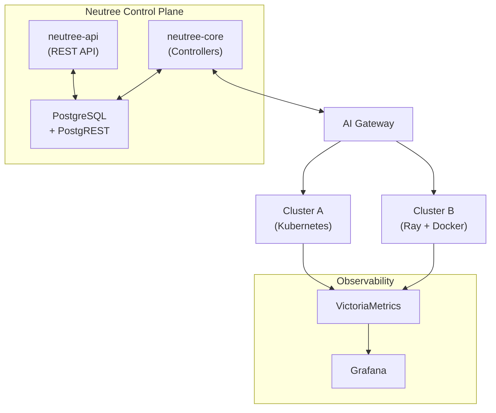
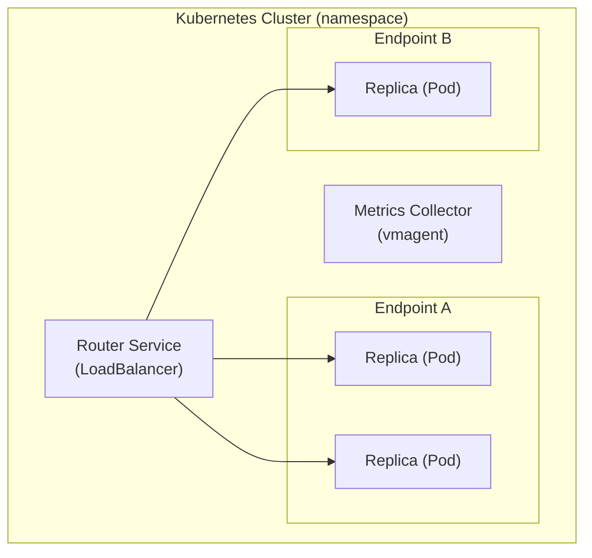
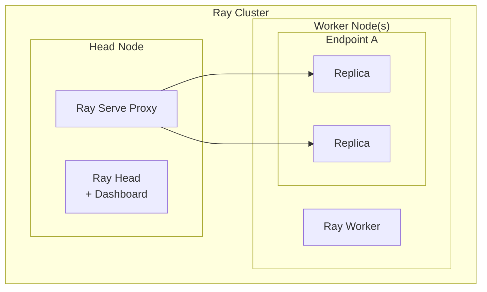

# Neutree Architecture Overview

This document provides a comprehensive overview of Neutree's architecture for developers who want to understand the system design or contribute to the project.

## System Overview

Neutree is an open-source Large Language Model (LLM) infrastructure management platform. The 1.0 release focuses on **online inference**, providing:

- **Multi-tenancy**: Workspace-based resource isolation with fine-grained RBAC
- **Heterogeneous cluster support**: Kubernetes-native clusters and static node clusters based on Ray + Docker
- **Declarative resource management**: Kubernetes-style controllers with reconciliation loops
- **Production-ready observability**: Integrated metrics, logging, and dashboards



## Core Components

### neutree-api

The REST API server that handles all user-facing operations.

- **Technology**: Go with Gin HTTP framework
- **Responsibilities**:
  - Proxying resource CRUD requests to PostgREST
  - Static file serving for the web UI
  - Authentication middleware (JWT validation)

### neutree-core

The control plane that manages resources through declarative controllers.

- **Technology**: Go with reconciliation loop pattern
- **Design Principles**:
  - **Idempotency**: Controllers can safely re-run reconciliation without side effects
  - **Spec/Status separation**: `spec` represents desired state (user-defined), `status` represents observed state (controller-updated)
  - **Soft delete**: Resources are marked with `deletion_timestamp` first, controllers handle cleanup, then resources are permanently removed

### PostgreSQL + PostgREST

The data layer combining PostgreSQL with PostgREST for HTTP-based database access.

- **PostgreSQL**: Primary data store with Row-Level Security (RLS) for fine-grained access control
- **PostgREST**: Automatically generates REST API from database schema
- **Benefits**:
  - Authorization enforced at database level, not application level
  - Automatic API generation reduces boilerplate code

### AI Gateway

The API gateway for routing inference requests to model endpoints, built on Kong.

- **Responsibilities**:
  - API key authentication and rate limiting
  - Request routing to inference endpoints across clusters
  - Usage logging for observability

## Cluster Architecture

Neutree supports two cluster modes with different trade-offs.

### Kubernetes Mode

Deploys a lightweight router and manages endpoints as native Kubernetes Deployments.



- **No Ray dependency**: Uses native Kubernetes Deployments
- **Router**: Watches pods and routes requests based on labels
- **High availability**: Leverages Kubernetes auto-healing and scheduling
- **Independent engine upgrades**: Each endpoint can use different engine versions

### Ray + Docker Mode (Static Nodes)

Provisions Ray clusters on bare-metal or VM nodes via SSH, running inference engines in Docker containers.



- **SSH provisioning**: Neutree connects to nodes via SSH and runs `ray up` commands
- **Ray Serve**: Handles endpoint deployment and request routing
- **Head node**: Single point managing cluster state and dashboard
- **Use cases**: On-premise GPU servers, environments without Kubernetes

### Comparison

| Aspect | Kubernetes Mode | Ray + Docker Mode |
|--------|-----------------|-------------------|
| Infrastructure | Kubernetes cluster | Bare-metal / VMs |
| High Availability | Native (no single point of failure) | Head node is single point |
| Request Routing | Custom Router | Ray Serve Proxy |
| Engine Upgrades | Independent per endpoint | Requires cluster image update |

## Resource Model

All resources follow a consistent structure:

```
Resource
├── id                 # Database primary key
├── api_version        # API version (e.g., "v1")
├── kind               # Resource type (e.g., "Cluster")
├── metadata
│   ├── name           # Unique identifier within workspace
│   ├── workspace      # Owning workspace (null for global resources)
│   ├── labels         # Key-value pairs for organization
│   ├── annotations    # Key-value pairs for metadata
│   ├── creation_timestamp
│   ├── update_timestamp
│   └── deletion_timestamp  # Set when soft-deleted
├── spec               # Desired state (user-defined)
└── status             # Observed state (controller-updated)
```

## Authentication

Neutree uses GoTrue integrated with PostgREST for authentication.

- **GoTrue + PostgREST**: GoTrue handles user login and issues JWT tokens. PostgREST validates the same JWT, enabling seamless authentication across the stack.
- **Two credential types**:
  - **User**: Authenticates via email/password or OAuth, receives JWT for UI and API access
  - **API Key**: Belongs to a specific user within a specific workspace, used for programmatic access and AI Gateway requests

## Authorization

Neutree implements RBAC (Role-Based Access Control) enforced at the database level via PostgreSQL Row-Level Security (RLS).

- **Permission**: Defined as `{resource}:{action}` (e.g., `cluster:create`, `endpoint:read`)
- **Role**: A named collection of permissions
- **RoleAssignment**: Binds a user to a role, either globally or within a specific workspace
- **Enforcement**: RLS policies call `has_permission()` function to check access on every database query

## Observability

Neutree provides integrated monitoring based on the VictoriaMetrics stack.

- **Metrics collection**: vmagent scrapes Prometheus metrics from clusters and endpoints
- **Storage**: VictoriaMetrics for time-series data
- **Visualization**: Grafana with pre-configured dashboards
- **Dynamic configuration**: neutree-core automatically updates vmagent scrape configs when clusters or endpoints change

## Directory Structure

```
neutree/
├── api/v1/           # Resource type definitions
├── cmd/
│   ├── neutree-api/  # API server entry point
│   ├── neutree-core/ # Controller entry point
│   └── neutree-cli/  # CLI tool
├── controllers/      # Resource controllers
├── db/migrations/    # Database schema migrations
├── deploy/chart/     # Helm chart for deployment
├── internal/
│   ├── cluster/      # Cluster provisioning (SSH & Kubernetes)
│   ├── gateway/      # AI Gateway integration
│   ├── orchestrator/ # Endpoint deployment
│   ├── observability/# Metrics collection config
│   └── routes/       # API route handlers
└── pkg/
    └── storage/      # Database access layer
```
