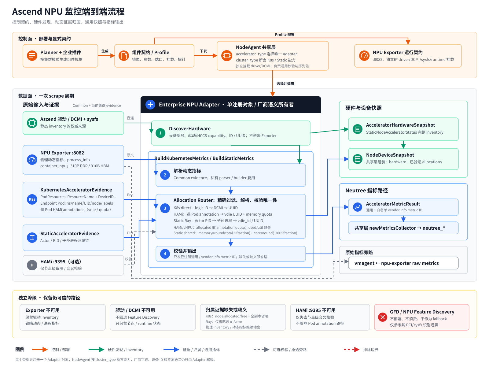

# Ascend NPU 监控权威设计

## 文档状态与阅读指引

> 文档总入口：[加速器监控设计文档索引](./accelerator-monitoring-design-index.md)。

本文是 Neutree 对 Ascend 物理 NPU 监控、整卡/die 分配和条件化副本指标的**权威设计**。它基于真实 310P3 集群（HDK 25.5.2、NPU Exporter v26.1.0、HAMi hami-core 软切分）的抓取证据，合并了此前三份文档的结论。

> **已确认的目标边界**：本次交付不部署 GFD 或 NPU Feature Discovery，目标 NodeAgent 数据面也不消费它们的 label/文件。NodeAgent 将通过企业 `npu` adapter 直接调用已验证的 Ascend 驱动/DCMI 接口探测静态硬件；NPU Exporter 保留为动态指标和进程证据来源。厂商 API、设备 ID 和字段映射全部归 adapter。该 Adapter 与 runtime 仍未实现，现状见“当前状态 vs 目标态”。

文档关系：

- [NPU 指标支持分析](./npu-metrics-support-analysis.md) 只保留版本化调研证据，不再定义 API、Profile、指标发布或 Roadmap；[NPU 监控详细设计](./npu-monitoring-design.md) 是历史设计草稿。实现只以本文为准。
- [NPU 指标支持矩阵](./npu-metrics-support-matrix.md) 是面向用户的验证状态记录，独立维护，本文引用。
- [加速器驱动探测与 Adapter 迁移方案](./nvml-replacement-and-feature-discovery.md) 定义 NVIDIA/NPU 共用的驱动探测边界以及 NVIDIA legacy DCGM 迁移契约；本文只定义 Ascend 产品和 allocation 语义。
- `docs/adr/0001-0003` 为独立审计轨迹，本文决策章节内嵌摘要并链接。

版本化证据：

| 证据面 | 固定版本 | 用途 |
|---|---|---|
| 运行镜像 | `swr.cn-south-1.myhuaweicloud.com/ascendhub/npu-exporter@sha256:cadb72be80649ae2596099e396f9f632eaa46dacc49d5d4adc653b805cef1699`（可读 tag：`v26.1.0-ubuntu22.04`） | Profile、启动参数、挂载和真实抓取行为 |
| 上游源码 | MindCluster `v26.1.0` tag，commit `9e132e216bb7b81f4a2742a4ac6d3b50754e8a77` | collector 注册条件、指标名、配置文件格式 |
| 脱敏抓取 | 2026-08-19，[`fixtures/npu-exporter-v26.1.0-310p.prom`](./fixtures/npu-exporter-v26.1.0-310p.prom) | adapter parser 与单位转换测试输入 |

镜像 digest 与源码 commit 是两个独立证据面；除非供应商提供可验证的构建 provenance，不因版本名相同就宣称该镜像一定由该 commit 构建。

读者入口：

- **评审**：读 §2（结论）、§3（决策）、§4（架构）、§5（指标契约）。
- **实现**：读 §4-§11。
- **验证状态**：去 [支持矩阵](./npu-metrics-support-matrix.md)。

### NEU-701 R2 修订决策

NEU-701 只交付静态 Ray/SSH 的 NPU 物理 die inventory 和动态物理指标。NodeAgent 继续补足 NPU Exporter 的静态驱动发现、厂商语义和 Neutree 指标转换，不替代 Exporter 的原始抓取与健康检查职责。

- Enterprise 发布一个通用 NodeAgent 镜像。它比 OSS 镜像多出 `npu` adapter 代码，但不按卡型或 accelerator type 拆分 tag，也不安装驱动、CANN 或 DCMI 运行时。
- HDK 25.5.2 是 adapter 的构建期 ABI 基线。NodeAgent 运行时只使用由宿主机、静态 Docker 配置或未来的 DevicePlugin 显式提供的设备、库和 sysfs；缺失时报告 discovery 失败，绝不从 Exporter 或 Feature Discovery 伪造 inventory。
- R2 静态 Ray/SSH 例外地从 `MetricsExporter.Runtime` 投影硬件访问字段给同机 NodeAgent，包括 namespace、privilege、capability、结构化 volume/mount、Docker 运行参数和必要环境变量；不会投影 Exporter 的 `Command`、`Args`、`Readiness` 或 `ConfigFiles`。
- 不新增 `NodeAgentRuntime` 公共 API。Kubernetes 不属于 NEU-701；R3 前必须重新验证 DevicePlugin 是否能向 NodeAgent DaemonSet 提供等价依赖，并在运行时需求分叉时拆分配置。

## 范围

### NEU-701 交付范围

NEU-701 实现 Roadmap 2 的静态物理指标子集：`DiscoverHardware`、`npu_info`、310P DDR/基础利用率解析和 exporter 不可达时的静态 inventory 保留。它不实现 Kubernetes NPU 部署、PodResources/HAMi、`container_npu_*`/`process_info` 归属、Ray Actor/PID 映射、`allocated/free`、endpoint/replica 指标或 HCCS/PCIe/vNPU 动态遥测。Roadmap 3 和 Roadmap 4 仍是后续设计，不是本 ticket 的验收内容。

> **当前版本能力边界**：副本级 `memory_allocated` 有三类有效来源：物理 die 唯一归属时使用 die total，调度系统提供显式配额时使用该配额，静态非切分共享卡使用 Ray GPU fraction。第三类沿用现有实现，按 `round(物理显存 MiB × gpuQuantity)` 生成 allocated memory，并按 `round(100 × gpuQuantity)` 生成 `CoreUnits`。Kubernetes 切分/虚拟化场景不提供实际资源使用量；静态非切分共享卡仅能按 Actor 进程汇总 `memory_used`，不能归属物理 utilization；整卡/die 独占分配时才同时提供实际 memory used 与 utilization。

首期包含：

- Neutree 管理 NPU Exporter（v26.1.0），保留其已启用的原始厂商指标供 vmagent 和客户诊断。
- Enterprise NodeAgent `npu` adapter 直接调用驱动/DCMI 探测静态硬件，并将已验证的 Exporter 动态指标转换为既有 `neutree_*` 通用指标。
- 静态 Ray/SSH 与 Kubernetes 的 die 级 inventory、allocation、free，以及满足证据条件的副本指标。
- **K8s 整卡直用 / die 独占**副本指标（exporter 精确归属，含 `memory_used`/`utilization`）。
- **K8s 软切分共享 / template vNPU** 副本的 `memory_allocated_bytes`（经 HAMi annotation 配额，不含实际占用）。
- **静态整卡独占 / 非切分共享卡**副本的 allocation 和按进程归属的 `memory_used`；非切分共享卡的 `memory_allocated` 与 `CoreUnits` 分别按 `round(物理显存 MiB × gpuQuantity)` 和 `round(100 × gpuQuantity)` 生成。
- CPU-only 节点与没有可用 Exporter 的节点的兼容行为。

首期不包含：

- GFD、NPU Feature Discovery 组件、node label 或本地输出文件集成；仅参考其 PCI/sysfs/产品识别实现。
- K8s 软切分共享 / template vNPU 副本的 `memory_used_bytes`、`utilization_ratio`（exporter 与 HAMi :9395 均无容器级切片/模板使用量来源，实测 `vnpu_pod_*`=0）。
- 静态非切分共享卡的 `utilization_ratio`（die 物理 util 无法唯一归属给任一共享者）。
- vNPU template-mode inventory、replica usage、dashboard（310P/910B 的 `vnpu_pod_*` 均不纳入通用契约）。
- 健康、功耗、频率、HCCS 链路计数/带宽、PCIe 带宽等新的动态厂商专属 `neutree_*` descriptor；首期唯一新增的专有 info descriptor 是 `neutree_node_accelerator_npu_info`。
- 910B PCIe bandwidth：上游只有 MB/ms Gauge，当前 Profile 关闭 `pcie`，Neutree collector 也没有对应 Gauge descriptor；不得复用 PCIe 累积字节 Counter，待独立指标设计和 910B E2E 后再引入。
- 多种加速器类型同时由一个 Kubernetes NodeAgent DaemonSet 处理。

## 实机调研证据（2026-08-12，fixture 于 2026-08-19 复核）

环境：单 worker NPU 节点，openEuler 22.03 LTS-SP4，HDK/驱动 25.5.2，containerd 2.3.3。物理拓扑：2 张 Atlas 300I Duo 卡（`machine_card_nums 2`）× 2 die = 4 个 NPU（`machine_npu_nums 4`）。运行镜像和源码版本按上表固定；Exporter 部署时挂载 containerd runtime 目录，因此容器 parser 可以获得容器关联。仓库 fixture 已移除节点地址、真实 UUID、Pod、容器、进程和时间戳。

抓取周期内有 5 个 endpoint Pod 调度在同一 NPU 节点，全部标注 `huawei.com/vnpu-mode: hami-core`（HAMi 软切分）。下文用 `pod-a` 至 `pod-e` 和 fixture UUID 表示脱敏后的 workload/device identity。

### 物理拓扑与分配

| die (exporter id) | vdie_id | 卡 / bus | total (MB) | 分配形态 |
|---|---|---|---|---|
| 0 | `...00000001` | 卡 A / `0000:01:00.0` | 44278 | die 独占（pod-a） |
| 1 | `...00000002` | 卡 A / `0000:01:00.0` | 43693 | die 独占（pod-b） |
| 2 | `...00000003` | 卡 B / `0000:02:00.0` | 44278 | die 独占（pod-c） |
| 3 | `...00000004` | 卡 B / `0000:02:00.0` | 43693 | **软切分共享（pod-d + pod-e）** |

注意：同一张卡的两个 die 物理 DDR total 容量不同（44278 vs 43693），是 300I Duo 硬件特性，不是误差。

### 软切分共享的 annotation 证据

`hami.io/Ascend310P-devices-allocated` 与 `huawei.com/Ascend310P` 是 HAMi 调度的分配事实，是软切分配额的权威来源：

- pod-d：`Ascend310P-0`，vdie `...00000004`，8192MB / 50 core
- pod-e：`Ascend310P-1`，vdie `...00000004`，8192MB / 50 core

两个 pod 的 `devices-allocated` 指向**同一个 vdie**，各自配额 8192MB/50core。`Ascend310P-<n>` 是 Device Plugin 逻辑分配编号，不是 die 物理 index。

### Exporter 在 die 独占 vs 软切分共享的行为差异（核心证据）

**die 独占**（pod-a/pod-b/pod-c）：exporter 的 `npu_container_info` 每个 die 一个 container、`container_npu_*` 等于该 die 物理值、`npu_chip_info_process_info` 带 `pod_name` 标签且按 pod 可聚合。

**同 die 软切分共享**（pod-d + pod-e）：exporter 对同一 vdie 的 `npu_container_info` **只保留一个 container 归属**，另一个 Pod 的容器归属**缺失**。同时 `container_npu_used_memory`/`npu_chip_info_used_memory` 报的是**整 die 物理 used**，不含切片信息。`npu-smi info` 与 exporter 对同一 die 的 used 一致（如 die3 6385/43693），软切分的 8192MB 配额对两者都不可见。

**进程 memory 语义**（以 die 独占样本为准）：

| die | pod | 进程数 | 进程 memory 和 (MB) | die used (MB) | 差值 |
|---|---|---|---|---|---|
| 0 | pod-a | 1 | 2759.2 | 4527 | 1768 |
| 1 | pod-b | 1 | 2759.2 | 3830 | 1071 |
| 2 | pod-c | 1 | 2759.2 | 4669 | 1910 |
| 3 | pod-e | 2 | 5518.4 | 6385 | 868 |

进程 memory 和 < die used：die used 含驱动、框架、缓存等非该 replica 独占的开销。因此副本 `memory_used_bytes` 采用进程 memory 和，不用 die 物理 used，与静态 Ray 路径语义统一。

### 整卡直用实测样本（K8s 非虚拟化，pod `-full-`）

另一次整卡直用抓取中，3 个 Pod 直接申请整卡（不使用 template 或 hami-core），分别独占 die 0/1/3，die 2 空闲：

| pod | die(id) | container used | container total | process_info 和 | chip used |
|---|---|---|---|---|---|
| pod-f | 0 | 1874 | 44278 | 101.2 | 1874 |
| pod-g | 1 | 1167 | 43693 | 101.2 | 1167 |
| pod-h | 3 | 1023 | 43693 | 431.2 | 1023 |
| (空闲) | 2 | — | 44278 | 无进程 | 1968 |

**验证结论**：

1. **`machine_npu_nums 4` 正确**——整卡直用无 template 拆分，逻辑设备数 = 物理 die 数 = 4（对照 template 模式下为 5）。
2. **`container_npu_*` = die 物理值**（整卡独占时完全成立）：container used 1874/1167/1023 分别等于 chip used。
3. **`npu_container_info` 每 die 一个 container**，归属无歧义（3 pod → 3 个独立 vdie）。
4. **进程 memory 和 < die used 再次印证**：die 3 进程 431 MB vs die used 1023；die 0 进程 101 MB vs die used 1874。`process_info` 按 pod 聚合才反映真实副本使用量。
5. **整卡直用路径下 exporter 完整可用**：container 归属、进程归属、物理指标全部正常。这直接验证了"**仅整卡/die 独占分配时才能获取实际资源使用率**"的边界。

**整卡直用 vs template 抓取对照**：

| 项 | 整卡直用（-full-） | template（-template-test-） |
|---|---|---|
| `machine_npu_nums` | 4（物理数）✅ | 5（逻辑设备数） |
| `container_npu_*` / `npu_container_info` / `process_info` | ✅ 完整可用 | ❌ 空 |
| 副本 memory_used / utilization | ✅ 可提供 | ❌ 不可提供 |

### HAMi :9395 证据

HAMi device-plugin 的 `:9395/metrics` 只输出 **host 级** `hami_host_gpu_memory_used_bytes` / `hami_host_gpu_utilization_ratio`，标签为 `device_index`/`device_type`/`device_uuid`，**没有** namespace/pod/container 标签，也**没有** `hami_vgpu_*` 容器级序列。`device_uuid` 与 exporter `vdie_id` 一致，`hami_host_gpu_memory_used_bytes`（bytes）与 `npu_chip_info_used_memory`（MiB）为同一物理量（1,912,602,624 bytes = 1824 MiB）。因此 HAMi :9395 对软切分也**给不出容器级切片使用量**，只能作节点级整卡指标的备用/交叉校验源。

## 结论总览（决策表）

| 决策 | 理由 | 被否方案 |
|---|---|---|
| **Kubernetes 软切分/template 副本当前只提供分配量**；静态非切分共享副本可按 Actor 进程汇总 `memory_used`，但不提供物理 utilization；仅 die 独占整卡副本同时提供实际 memory used 与 utilization | exporter 对 HAMi 的软切分与 template 虚拟化层均不可见；静态进程 memory 可唯一归属 Actor，但 die 物理 utilization 不能唯一归属共享者 | 从 exporter 拿模板/切片使用量；把共享 die utilization 复制给每个 Actor |
| NodeAgent 的 `npu` adapter 直接调用驱动/DCMI 探测设备级静态硬件；NPU Exporter 采集动态指标和进程证据 | 静态 inventory 不应依赖 Exporter 可用性；驱动 ABI、设备 ID 和字段语义封装在企业 adapter 内。DCMI 不替代调度归属证据 | 部署 NPU Feature Discovery；仅依赖 Exporter 反推静态硬件 |
| 软切分共享与 template vNPU 的 `memory_allocated` 用 HAMi annotation 配额 | exporter 与 :9395 均无容器级切片/模板使用量；annotation 的 vdie+memory+core 是调度分配事实 | exporter 整卡 total（虚报）；:9395 host 级（无 pod 粒度） |
| HAMi allocation evidence 按 Pod 保存 metadata + annotations | 同节点多个 Pod 的 vdie、memory 和 core 配额不同，节点级 annotation map 无法表达 | 单个 `NodeAnnotations map[string]string` |
| die 独占副本 `memory_used` 用 exporter `process_info` 按 pod 聚合 | `process_info` 带 pod_name，与静态 Ray 语义统一；不虚报（进程和 < die used） | die 物理 used fallback（虚报 868~1910MB） |
| **软切分共享 / template vNPU 不支持实际资源使用采集**：`memory_used`/`utilization_ratio` 均不输出，只给 HAMi annotation 分配量 | exporter 对 HAMi 软切分/template 虚拟化层不可见（实测 `vnpu_pod_*`=0、容器归属丢失）；切片/模板级使用量两个源都无 | 从 exporter `vnpu_pod_*` 或 `container_npu_*` 取切片使用量（实测均不可用） |
| 静态非切分共享卡的 memory/core allocated 按 Ray GPU fraction 生成 | 现有 `allocationDeviceCapacity()` 已用 `round(device.MemoryMiB × gpuQuantity)` / `round(100 × gpuQuantity)` 生成 `MemoryMiB`/`CoreUnits` 分配份额；沿用该契约可避免把整卡 total 复制给每个 Actor | 共享场景全部不输出 allocated；把同一 die total/100 core units 复制给所有共享 Actor |
| allocation 权威来源 = PodResources / Ray Dashboard / HAMi annotation | 都是调度事实，不是 DCMI 事实 | exporter 容器元数据（软切分共享丢归属） |
| NPU 专有 info 与 HCCS 动态遥测分离 | 驱动版本、规范化型号和产品级 HCCS collector 能力是静态 info；HCCS 链路计数/带宽还依赖产品、主板、配置、驱动 API 与真机验证 | 用是否出现 HCCS 时序反推静态能力；把 910B 上游 collector 白名单写成当前 Neutree 遥测支持 |
| 910B PCIe bandwidth 延期 | 上游是 MB/ms Gauge，当前 Profile 关闭 `pcie` 且 collector 没有对应 descriptor | 复用 PCIe byte Counter 或在首期承诺不可产生的专属指标 |
| 运行镜像、源码和 fixture 分别固定 | tag 可漂移，源码 commit 与运行镜像也不能无 provenance 地视为同一构建 | `master` 链接、本机路径或 tag-only Profile |
| 缺失时不输出 0/NaN/unknown | 避免把未知当故障 | 输出零值/未知序列 |
| 310P 结论不外推 910B | 910B collector capability 与 310P 不同（HBM vs DDR、overall util） | 直接套用 310P 映射 |
| `Privileged=true` 首期显式默认 | 官方 Exporter 需要宿主设备访问，310P probe 已验证 | 非特权首期 |

## 架构决策与 ADR 影响

> `ADR-0001` 至 `ADR-0003` 记录的是此前以 Exporter 为唯一物理证据源的方案。本次确认
> 改变了其中“无 Exporter 即无加速器样本”“DCMI 不进入 NodeAgent”和“结构化驱动挂载
> 只服务 Exporter”三项前提。下列条目是当前有效的修订后决策；ADR 文件需在纳入受控
> 文档后单独同步。在此之前，与驱动探测边界冲突处以本文为准。

- **[ADR-0001](./adr/0001-enterprise-owned-accelerator-metrics-adapters.md) 企业拥有 adapter**：OSS 只提供厂商无关 adapter registry + 显式 accelerator-type 透传；`npu` adapter 的注册、驱动/DCMI 探测、Exporter 解析和 Ascend 运行时要求全在企业 Node Agent 镜像。CPU-only 无 adapter 可启动；配置了类型但 adapter 未注册则 fail-fast。
- **[ADR-0002](./adr/0002-structured-component-volumes.md) 结构化挂载**：用 backend-neutral `ComponentVolume`/`VolumeMount` 表达宿主机驱动、设备、权限；禁止把 `--volume`/`--device` 藏进 `DockerRunOptions`。默认情况下 Exporter 和 NodeAgent 分别声明 runtime 输入；NEU-701 的静态 Ray/SSH 例外从同一 `MetricsExporter.Runtime` 投影硬件访问字段，且不传播 Exporter 的启动、readiness 或 scrape 配置。新增 `Command`（K8s `args` 会替换镜像 CMD）、`Privileged`（默认关，NPU Exporter 首期显式 true）。
- **[ADR-0003](./adr/0003-adapter-owned-accelerator-metric-aggregation.md) adapter 聚合**：registry 按 `accelerator_type` 只注册和选择一个 `Accelerator` 对象；NodeAgent 再按显式 `cluster_type` 断言 `KubernetesAccelerator` 或 `StaticAccelerator` 能力。共享层只采与集群类型匹配的强类型原始 evidence，adapter 做全部厂商语义（含驱动字段、Exporter 指标和 HAMi annotation 解析），两个能力接口返回同一受限 `AcceleratorMetricResult`。驱动探测、动态证据与调度证据独立降级。
- **Feature Discovery 边界（本次确认）**：不部署 GFD/NPU Feature Discovery，不消费其 label 或文件；只参考其 PCI/sysfs/产品识别逻辑。
- **动态指标源（本次确认）**：单 `npu` adapter 解析 npu-exporter :8082 与 HAMi annotation；HAMi :9395 仅作节点级备用/交叉校验源，不进入 adapter 的副本指标路径。

## 总体架构与所有权边界



图中橙色为部署契约，绿色为硬件发现与 inventory，蓝色为动态证据、归属和通用指标，灰色虚线为可选校验或原始指标旁路。下面保留等价的文字版主干，便于检索和评审：

```text
NodeAgent shared layer
          | selects by explicit accelerator_type
          v
Enterprise NPU adapter (one registered object)
          |
          +--> Accelerator: Ascend driver/DCMI + sysfs
          |      -> AcceleratorHardwareSnapshot
          |
          +--> KubernetesAccelerator
          |      +<-- KubernetesAcceleratorEvidence
          |      |      - Common: npu-exporter :8082 raw samples
          |      |      - PodResources / Endpoint Pods / HAMi annotations
          |      +--> AcceleratorMetricResult
          |
          +--> StaticAccelerator
                 +<-- StaticAcceleratorEvidence
                 |      - Common: npu-exporter :8082 raw samples
                 |      - Ray actor/PID/process evidence
                 |      - HAMi :9395 optional node-level cross-check
                 +--> AcceleratorMetricResult
                            |
                            v
shared layer: timeout, common labels, descriptor/unit validation, serialization

vmagent <--------- npu-exporter raw metrics (kept unchanged)
```

共享层负责 Adapter 选择与调用、I/O、超时、公共标签、Prometheus 序列化、CPU 兼容、descriptor/单位校验及 Exporter target 发现。它先按 `accelerator_type` 从单一 registry 取得一个基础 `Accelerator` 对象，再按显式 `cluster_type` 断言 `KubernetesAccelerator` 或 `StaticAccelerator`；当前集群所需能力未实现时启动 fail-fast，不能根据 evidence 哪些字段非空来猜集群模式。target 的端口、metrics path 和 Pod 匹配标识由 planner 从选中的 Profile/type 原子下发，shared provider 不硬编码厂商 exporter 名称。共享层不初始化 DCMI、不解释厂商资源名、device ID、环境变量或指标名。Feature Discovery 不在运行时数据流中。

### Adapter 接口设计

adapter 是“厂商驱动/Exporter 原始输入 → Neutree 通用硬件信息和指标”的唯一转换点。当前 normalizer 的 `normalizeAcceleratorSamples` 等函数硬编码 DCGM→`neutree_*` switch；adapter 设计把驱动探测和指标转换抽成按 `accelerator_type` 选择的实现。

**接口**：

```go
// Accelerator 是 NodeAgent 内按 accelerator_type 注册的厂商适配器。
// 只有已注册的 adapter 才会被 NodeAgent 选择；无类型走 legacy DCGM 兼容路径。
type Accelerator interface {
    // Type 返回本 adapter 处理的 accelerator_type（如 "npu" 或 "nvidia_gpu"）。
    // 注册后必须与 planner 下发的 --accelerator-type 一致。
    Type() string

    // DiscoverHardware 通过厂商驱动和必要的 sysfs 探测设备级静态信息。
    // 调用不依赖 Exporter scrape，结果不得来自 Feature Discovery label/文件。
    DiscoverHardware(ctx context.Context) (model.AcceleratorHardwareSnapshot, error)
}

// KubernetesAccelerator 是同一注册对象可选实现的 Kubernetes 集群能力。
// NodeAgent 仅在显式 Kubernetes cluster_type 下断言并调用该接口。
type KubernetesAccelerator interface {
    Accelerator

    // BuildKubernetesMetrics 将 Kubernetes 证据转换为 Neutree 通用加速器指标。
    // hardware 是共享层为本次转换提供的不可变 DiscoverHardware 快照。
    // 结果只能使用既有通用 metric ID 与经批准的专有 info metric ID。
    BuildKubernetesMetrics(
        ctx context.Context,
        hardware model.AcceleratorHardwareSnapshot,
        evidence KubernetesAcceleratorEvidence,
    ) (AcceleratorMetricResult, error)
}

// StaticAccelerator 是同一注册对象可选实现的静态 Ray/SSH 集群能力。
// NodeAgent 仅在显式静态 cluster_type 下断言并调用该接口。
type StaticAccelerator interface {
    Accelerator

    // BuildStaticMetrics 将静态 Ray/SSH 证据转换为 Neutree 通用加速器指标。
    // hardware 是共享层为本次转换提供的不可变 DiscoverHardware 快照。
    // 结果只能使用既有通用 metric ID 与经批准的专有 info metric ID。
    BuildStaticMetrics(
        ctx context.Context,
        hardware model.AcceleratorHardwareSnapshot,
        evidence StaticAcceleratorEvidence,
    ) (AcceleratorMetricResult, error)
}
```

`DiscoverHardware` 的驱动 client 初始化、关闭、错误转换、设备 ID 解释和字段映射都由 adapter 拥有。registry 只保存一次 `Accelerator` 基础对象，不为 Kubernetes 和静态集群分别注册实例；一个同时支持两种集群的 NVIDIA/NPU 实现由同一个 concrete object 实现两个能力接口，并可在内部复用 parser、resolver 和 sample builder。共享层只调度该对象，并把本次返回的不可变快照显式传给当前集群的能力方法，不在 adapter 内保存跨抓取的隐式硬件状态；即使 `Common.ExporterUp=false` 也必须执行硬件探测。返回值直接包含现有 `v1.StaticNodeAcceleratorStatus` 所需的完整 inventory，而不是用 allocation 类型冒充设备快照。驱动错误的重试和降级策略在 Adapter 生命周期实现中统一收敛，不得回退到 Feature Discovery。

**`CommonAcceleratorEvidence` / `KubernetesAcceleratorEvidence` / `StaticAcceleratorEvidence`（瞬时输入，不解释厂商语义）**：

共享层在一次 scrape 周期内只负责收集**原始、未解释**证据，不负责"理解"。三个核心语义：

- **不解释厂商语义**：只携带原始字符串/原始记录（Exporter 文本、PodResources 原始分配、HAMi annotation 原文），不解析 `npu_chip_info_*` 是什么、`Ascend310P-0` 是什么、配额是多少。这些全部留给 adapter。
- **不做归属判断**：不回答"这个 vdie 属于哪个 endpoint"。PodResources/Ray/HAMi 证据只是并列摆着，归属是 adapter 在 `BuildKubernetesMetrics` / `BuildStaticMetrics` 里做的。
- **不预先解释 device ID**：`Ascend310P-<n>`、`vdie_id`、`super_device_id` 的映射关系，evidence 不碰。

两个集群 evidence 都内嵌同一 `CommonAcceleratorEvidence`：公共部分只承载 exporter 原始文本与 scrape 成功位；`KubernetesAcceleratorEvidence` 另承载 kubelet PodResources 原始分配（复用现有 `allocation.PodResourceLister` 返回的 `model.PodResource`，含 `ResourceName + DeviceIDs` 原始形态）以及逐 Pod 的 endpoint metadata/HAMi annotation；`StaticAcceleratorEvidence` 另承载静态 Ray 的 Actor/PID/进程证据。`AcceleratorType` 不属于 evidence，它只用于 registry 选择和配置校验。驱动探测结果由同一 adapter 的 `DiscoverHardware` 产生，不伪装成共享层采集的原始 evidence。

**与现有 `allocation.Provider` 的对照**：现有 `Provider.Allocations(ctx, *NodeDeviceSnapshot)` 输入**已解释**的设备快照、返回已归属分配，是“解释后”路径；两个集群 evidence 是**解释前**路径——共享层只采集原始证据，adapter 理解。驱动探测结果、Exporter 动态证据与调度证据（PodResources/Ray/annotation）**独立存在、独立降级**，一方失败不阻止其它路径执行。

**生命周期**：每次 scrape 周期的瞬时值，非持久状态；属于 `internal/observability/...`，不进 `api/v1`，不是外部插件协议。

```go
type CommonAcceleratorEvidence struct {
    // ExporterText 是 accelerator exporter 抓取的原始 Prometheus 文本。
    // adapter 自行解析厂商指标名（如 npu_chip_info_*、container_npu_*）。
    ExporterText string

    // ExporterUp 表示本节点 accelerator exporter 是否抓取成功。
    // adapter 不判定 readiness，只据此跳过无样本的解析。
    ExporterUp bool
}

type KubernetesAcceleratorEvidence struct {
    Common CommonAcceleratorEvidence

    // AllocationAvailable 区分“采集失败”与“成功采集且当前零分配”。
    // false 时 adapter 省略 allocation/replica；true + 空切片表示有效零分配。
    AllocationAvailable bool

    // PodResources 是 kubelet PodResources 的原始分配记录（ResourceName + device ID）。
    // 复用现有 allocation.PodResourceLister 返回的 model.PodResource（含 ResourceName + DeviceIDs）。
    PodResources []model.PodResource

    // EndpointPods 按 Pod 保存 endpoint metadata 与原始 annotations。
    // Kubernetes 路径按 namespace/name 与 PodResources 精确连接。
    EndpointPods []EndpointPodEvidence
}

type StaticAcceleratorEvidence struct {
    Common CommonAcceleratorEvidence

    // false 表示 Dashboard/进程证据整体不可用；true + 空 Actor 表示有效零分配。
    AllocationAvailable bool

    // RayEvidence 是静态 Ray 路径的 Dashboard actor/PID/process 证据。
    RayEvidence RayEvidence
}

type EndpointPodEvidence struct {
    Namespace   string
    Name        string
    UID         string
    NodeName    string
    Labels      map[string]string
    Annotations map[string]string
}

type RayEvidence struct {
    Actors       []RayActor     // Dashboard Backend Actor（含 required_resources）
    ActorProcesses map[int]ProcessInfo // Actor PID -> 后代 NPU 进程
}
// RayActor / ProcessInfo 复用现有 RayServeAllocationProvider 的输入模型
// （dashboard.RayActor、allocation.ProcessInfo），不另起炉灶。
```

共享层只构造与显式 `cluster_type` 匹配的 evidence，不创建另一个集群类型的空对象，也不靠字段是否为空分派。Kubernetes 路径只收集本节点、非终态的 endpoint Pod；每个 Pod 生成一条 `EndpointPodEvidence`。`Labels` 和 `Annotations` 必须复制后再传给 adapter，不能持有 informer cache 中可变 map。`namespace/name` 在同一 `KubernetesAcceleratorEvidence` 中必须唯一；PodResources 或 Pod metadata 采集失败时设置 `AllocationAvailable=false`。采集成功时，即使没有 PodResources 记录也设置为 true，由 adapter 区分真实零分配；PodResources 找不到对应 Pod、同名记录 UID 冲突或厂商语义歧义，则 adapter 将整个 Kubernetes allocation 路径判为不可用。HAMi 的 `devices-allocated`、memory quota、core 和 `vnpu-mode` 都从对应 Pod 的 `Annotations` 读取；不再存在节点级 `NodeAnnotations` fallback。静态路径在 Dashboard/进程证据整体采集失败时设置 `AllocationAvailable=false`；采集成功但 Actor 为空时为 true，单个 Actor 证据不完整仍由 adapter 做逐 Actor 降级。

**`AcceleratorMetricResult`（受限输出）**：

```go
type AcceleratorMetricResult struct {
    // Allocations 是解释后的 workload -> device 分配；DeviceAllocation 只在这里使用。
    Allocations []v1.StaticNodeAllocationStatus

    // Samples 是 adapter 生成的通用 neutree_* 样本。
    // 只允许既有通用 metric ID、经批准的专有 info metric ID 和受校验标签；
    // 缺失、歧义、未验证时省略样本。
    Samples []normalizer.Sample
}
```

**两个集群能力接口内的处理流程**（同一个 `npu` adapter 对象）：

1. **校验静态硬件**：以 `DiscoverHardware` 返回的完整 `StaticNodeAcceleratorStatus` 为 inventory 权威；ID/UUID 必须非空且在节点内唯一。Exporter 的 `vdie_id`/`id`/`model_name` 只用于动态样本关联和交叉校验。
2. **内存指标族 fallback**：同一 `vdie_id` 上完整 HBM `used+total` 对优先，完整 DDR 对 fallback（310P 用 DDR、910B 用 HBM）。
3. **util fallback**：`overall_utilization` 优先，fallback 基础 `utilization`（910B）；cube 不纳入。
4. **副本归属分流**（按已断言的能力接口）：
   - Kubernetes：`AllocationAvailable=false` 时跳过全部 allocation/replica 输出；为 true 时，`BuildKubernetesMetrics` 先按自己拥有的精确 ResourceName 集合过滤 PodResources，再把每条记录按 `namespace/name` 连接到 `EndpointPodEvidence`；HAMi annotation 始终按 Pod 解析。
   - 整卡直用的 Device Plugin ref 由 adapter 解析为 logic ID，经 DCMI 转换后连接到本周期 driver snapshot；HAMi Pod 则只用该 Pod annotation 的 vdie UUID。共享层不得截取末段数字，任何路径找不到、重复或歧义时，整个 Kubernetes allocation 路径在本周期失效。
   - 静态 Ray：`AllocationAvailable=false` 时跳过全部 allocation/replica 输出；为 true 时，`BuildStaticMetrics` 通过 `RayEvidence` 的 Actor PID → 后代进程 → `vdie_id`。单个 Actor 归属失败只省略该 Actor，但依赖完整集合的节点 aggregate 同时省略。
5. **生成受限结果**：allocation 使用 `v1.StaticNodeAllocationStatus`；样本只使用 collector 已注册的 metric ID。缺失或歧义时不输出。

**normalizer 迁移路径**（GPU 侧渐进式）：

- 现有 `normalizeAcceleratorSamples`/`normalizeNodeGPUSamples`/`normalizeGPUHardwareInfoSamples`/`normalizeEndpointAllocationSamples` 保持 DCGM 行为，作为 legacy 路径。
- 新增 `internal/observability/neutreemetrics/adapter/` 包：基础 `Accelerator` registry、`KubernetesAccelerator` / `StaticAccelerator` 能力接口、`CommonAcceleratorEvidence`/两个集群 evidence 和 `AcceleratorMetricResult`。
- NodeAgent 装配：`--accelerator-type` 非空时从 registry 取唯一 adapter 对象，独立调用 `DiscoverHardware`，再按显式节点类型断言并调用 `KubernetesAccelerator.BuildKubernetesMetrics` 或 `StaticAccelerator.BuildStaticMetrics`；能力缺失时启动失败。结果送入现有 normalizer 的通用样本出口（公共标签、descriptor 校验、序列化）。Adapter 返回空结果也仍属于当前显式路径，不能触发 legacy DCGM fallback；只有 `--accelerator-type` 为空时才进入 legacy 路径。
- NVIDIA 先把现有 NVML hardware provider 收敛进 `nvidia_gpu` adapter，再渐进迁移 DCGM 动态指标和 allocation 解释；不引入 GFD provider。

**NVIDIA 兼容边界**：上述接口是 NPU 与 NVIDIA 的共同目标，但当前 NVIDIA 仍走 `server.go → devicesnapshot/normalizer → newMetricsCollector` 的 legacy DCGM 路径，NVML 也只有 Exporter scrape 成功后才执行。迁移期 `accelerator_type` 为空只走 legacy；显式 `nvidia_gpu` 只走 Adapter，二者不得同时输出。同样，现有 `nvidia.com/gpu.present` placement 和 `nvidia.com/gpu.product` 分组是控制面/HAMi 兼容依赖，不是 NodeAgent inventory 权威。完整现状、目标字段源和退出条件见[通用迁移方案](./nvml-replacement-and-feature-discovery.md#nvidia-当前兼容路径)。

### 通用硬件快照与指标输出处理

`v1.DeviceAllocation` 只表示 workload 分配，不能表示 inventory。`DiscoverHardware` 必须直接对齐现有 `NodeDeviceSnapshot.Accelerator` 消费链，并把额外拓扑字段放在独立 details 中：

```go
// internal/observability/neutreemetrics/model/accelerator_hardware.go
type AcceleratorHardwareSnapshot struct {
    // Accelerator 可直接写入 v1.NodeDeviceSnapshot.Accelerator。
    Accelerator v1.StaticNodeAcceleratorStatus

    // Details 按 UUID 补充指标所需、但不属于资源快照的字段。
    Details []AcceleratorHardwareDetails
}

type AcceleratorHardwareDetails struct {
    UUID           string
    Architecture   string
    DriverVersion  string
    PCIEBusID      string
    PCIEGeneration string
    PCIEWidth      string
    NUMANode       string
}
```

`Accelerator.Devices` 使用现有 `v1.StaticNodeAcceleratorDeviceStatus`，因此 adapter 必须填充 `ID`、`UUID`、`ProductName`、`ProductModel`、`MemoryMiB` 和明确的 `Healthy`；`MinorNumber` 在厂商不适用或驱动无法提供时可以为 nil。NPU 的 `Healthy` 来自本周期已验证的驱动/DCMI health 查询，不以一次 Exporter scrape 成功代替。必填字段缺失、ID/UUID 重复或 health 无法判定时，整个 inventory snapshot 无效，不写入 StaticNode/Kubernetes 设备注解，也不执行 allocation；node/runtime 指标仍可输出。

共享层以该结果构造：

```go
snapshot := &v1.NodeDeviceSnapshot{
    Accelerator: hardware.Accelerator,
    Allocations: result.Allocations,
}
```

厂商专属字段仍留在 adapter 内部。NVIDIA adapter 可以在内部保存 CUDA/NVLink/NVSwitch 扩展，仅在生成 `neutree_node_accelerator_nvidia_info` 时使用；NPU adapter 同样在内部保存驱动版本、驱动设备类型和产品级 HCCS collector capability，仅在生成 `neutree_node_accelerator_npu_info` 时使用。这些字段不进入通用 snapshot。

**指标输出的现状与目标**：

- **现状**：`handleMetrics`（server.go）→ `normalizer.Samples(normalizeReq)` 生成全部 `neutree_*` 样本（含 `normalizeGPUHardwareInfoSamples` 生成的 `hardware_info`/`nvidia_info`）→ `newMetricsCollector`（collector.go）白名单/标签校验 + Prometheus 序列化 → HTTP 暴露。`GPUHardwareInfos` 从 server.go 传入 normalizer。
- **目标**：样本生成移到 `adapter.BuildKubernetesMetrics()` / `BuildStaticMetrics()`——adapter 生成 `hardware_info`（通用字段）与专属指标（nvidia 的 `nvidia_info`、npu 的 `npu_info`），结果 `AcceleratorMetricResult.Samples` 直接进 `newMetricsCollector` 公共出口；collector 复用既有白名单校验、标签补全和 Prometheus 序列化**机制**（`AcceleratorMetricResult.Samples` 与现有 `[]normalizer.Sample` 同构），但实现 `npu_info` 时必须显式新增 descriptor、label 列表和 required-label 规则，不能理解为 collector 代码零修改。
- **设备快照路径**：adapter 路径不再调用 `applyGPUHardwareInfoToSnapshot`；`DiscoverHardware` 已产生完整 `StaticNodeAcceleratorStatus`。该函数只保留给 legacy DCGM/NVML 路径，直至 NVIDIA adapter 完成迁移。

```
handleMetrics（server.go）
  ├─ adapter 路径:  result.Samples → newMetricsCollector → Prometheus
  └─ legacy 路径:   normalizer.Samples → newMetricsCollector → Prometheus
       （DCGM 未迁移时双轨并存；迁移完成后只剩 adapter 路径）
```

### 企业版注册机制（镜像 core 注入模式）

NodeAgent 侧的 adapter 注册**完全镜像 core 的 accelerator plugin 注入模式**（`internal/accelerator/plugin/` 的包级 registry + `init()` 注册），Enterprise 通用 NodeAgent 镜像内置 `npu` adapter。

**core 注入模式（参考模板，已存在）**：

```go
// internal/accelerator/plugin/plugin.go（controller 进程）
var plugins = make(map[string]AcceleratorPlugin)
func registerAcceleratorPlugin(p AcceleratorPlugin) { plugins[p.Resource()] = p }
func GetLocalAcceleratorPlugins() map[string]AcceleratorPlugin { return plugins }

// internal/accelerator/plugin/gpu.go（OSS 内置）
func init() { registerAcceleratorPlugin(&GPUAcceleratorPlugin{...}) }

// internal/accelerator/manager.go:90（启动自动加载）
for _, p := range plugin.GetLocalAcceleratorPlugins() { ... }
```

**NodeAgent 侧 adapter 注入（本次新增，同构）**：

```go
// internal/observability/neutreemetrics/adapter/adapter.go（node-agent 进程）
var adapters = make(map[string]Accelerator)
func Register(a Accelerator) { adapters[a.Type()] = a }
func GetLocalAccelerators() map[string]Accelerator { return adapters }

// internal/observability/neutreemetrics/adapter/nvidia.go（OSS 内置）
var _ Accelerator = (*nvidiaAccelerator)(nil)
var _ KubernetesAccelerator = (*nvidiaAccelerator)(nil)
var _ StaticAccelerator = (*nvidiaAccelerator)(nil)
func init() { Register(&nvidiaAccelerator{}) }

// npu.go（企业 NodeAgent 镜像源码树，OSS 不含）
var _ Accelerator = (*npuAccelerator)(nil)
var _ KubernetesAccelerator = (*npuAccelerator)(nil)
var _ StaticAccelerator = (*npuAccelerator)(nil)
func init() { Register(&npuAccelerator{}) }

// cmd/neutree-node-agent/main.go（装配）
registry := adapter.GetLocalAccelerators()
server, _ := neutreemetrics.NewServer(config.WithAccelerators(registry))

// server 启动时按 accelerator_type 取得同一个对象，再按 cluster_type 断言能力。
selected := registry[acceleratorType]
// Kubernetes: selected.(KubernetesAccelerator)
// Static:     selected.(StaticAccelerator)
// 未注册或当前 cluster_type 的能力断言失败都必须 fail-fast。
```

**Enterprise 通用 NodeAgent 镜像**：企业 fork 仓库在 `adapter/npu.go` 加一次 `init() { Register(&npuAccelerator{}) }`，构建出带 `npu` adapter 的单一 Enterprise 镜像。镜像不携带 Ascend 驱动、CANN 或 DCMI 运行时，也不按 `npu`、310P 或 910B 生成 tag 变体。`npuAccelerator` 同时实现基础接口和两个集群能力接口，但 registry 中只有同一对象的一条 `npu` 记录，不存在 `npu-kubernetes` / `npu-static` 两套注册。OSS 镜像不含 `npu.go`，`GetLocalAccelerators()` 只有 nvidia。Enterprise 发布配置选择该通用镜像；planner 仅以 `--accelerator-type=npu` 激活对应 adapter。未注册或不支持当前 `cluster_type` 都 fail-fast。

**与 core 的对齐点**：

| core（controller） | node-agent（镜像） | 一致 |
|---|---|---|
| `plugin.go` 包级 registry | `adapter.go` 包级 registry | ✅ 同构 |
| `init()` 注册 GPU/AMD | `init()` 注册 nvidia/npu | ✅ 同构 |
| `GetLocalAcceleratorPlugins()` | `GetLocalAccelerators()` | ✅ 同构 |
| manager 启动自动加载 | NodeAgent main 装配 registry | ✅ 同构 |
| 企业 fork 加 plugin | 企业 fork 加 `npu.go` | ✅ 同构 |

**接口边界**：`CommonAcceleratorEvidence`/`KubernetesAcceleratorEvidence`/`StaticAcceleratorEvidence`/`AcceleratorMetricResult`/`Accelerator`/`KubernetesAccelerator`/`StaticAccelerator` 属于 `internal/observability/...`，是瞬时 Node Agent 实现数据，不进入 `api/v1`，也不构成外部插件协议。`api/v1` 仅保留可部署的 Profile/Runtime 与声明式配置。

## 指标契约

`accelerator_uuid` 和 `accelerator_index` 以 `DiscoverHardware` 的驱动/DCMI 结果为权威；Exporter `vdie_id`/`id` 必须经 Adapter 验证后关联到该硬件快照。label 结构完全复用现有 `endpointAcceleratorLabelNames`（`cluster_type/endpoint/instance_id/replica/node/accelerator_type/accelerator_uuid/accelerator_index/vdevice_index/product`），**不为 HAMi 增加 core/vnpu-mode 标签**。`accelerator_type` = 企业插件返回的 `npu`。

NPU inventory 中 `ProductName` 保存驱动/DCMI 返回的可读产品或芯片名称，`ProductModel` 保存 Adapter 根据驱动 `GetDevType()` 和芯片信息归一化的稳定系列键（首期为 `Ascend310P`、`Ascend910B`）。目标 NPU Adapter 必须同时填充两者；现有 `firstNonEmpty(ProductModel, ProductName)` 兼容逻辑因此稳定选择 `ProductModel` 作为通用 `product` label。Exporter `npu_chip_info_name.name`（如 `310P3-Ascend-V1`）只作动态关联和交叉校验，不覆盖 inventory；固定 commit 源码和仓库 fixture 的实际 label 是 `name`，与上游 API 文档中偏向 `model_name` 的表述不完全一致，parser 以固定 exposition/fixture 为准。`npu_chip_info_product_type.product_type` 仅 310P 上游稳定提供，不能用作 910B 的通用型号来源。

### 物理 / die 级指标

| 通用指标 | 310P 来源 | 910B 来源 | 单位转换 | 缺失语义 |
|---|---|---|---|---|
| `neutree_accelerator_utilization_ratio` | `npu_chip_info_utilization`（唯一） | `npu_chip_info_overall_utilization`（优先，÷100）→ fallback `npu_chip_info_utilization`；**cube 不纳入** | % ÷ 100 | 无有效样本则缺失 |
| `neutree_accelerator_memory_used_bytes` | `npu_chip_info_used_memory`（DDR） | `npu_chip_info_hbm_used_memory`（HBM） | MiB × 2^20 | 同 die 两族均不完整则缺失 |
| `neutree_accelerator_memory_total_bytes` | `npu_chip_info_total_memory`（DDR） | `npu_chip_info_hbm_total_memory`（HBM） | MiB × 2^20 | 同上 |
| `neutree_accelerator_temperature_celsius` | `npu_chip_info_temperature` | 同左 | 直出 | 缺失 |
| `neutree_node_accelerator_info` | Adapter 驱动/DCMI 设备清单 | 同左 | — | 每个稳定硬件 ID 一条；Exporter 标签不触发发现 |
| `neutree_node_accelerator_npu_info` | Adapter 驱动/DCMI + 固定版本产品能力表；`node_base_info.driverVersion`、`npu_chip_info_name` 只作交叉校验 | 同左 | — | 型号使用通用 `product`；任一专有字段无法确认时 Adapter 不生成整条 sample，静态 inventory 不受影响 |
| `neutree_node_accelerator_total` | Adapter 驱动/DCMI 设备清单 | 同左 | — | 按驱动 product 和稳定硬件 ID 计数；`machine_npu_nums` 只作诊断（template 下它是逻辑设备数 5，物理 die 仅 4） |
| `neutree_node_accelerator_allocated/free` | PodResources / Ray / annotation 的 die 级唯一集合 | 同左 | — | 仅在调度证据完整时输出 |

### NPU 专有 info 与 HCCS 能力

- `neutree_node_accelerator_npu_info` 是值恒为 `1` 的 info Gauge。label 复用物理设备公共标签，并补充 `driver_version` 与 `hccs_capable`；型号不再增加第二个 `model` label，而是使用上文定义的通用 `product`。新 descriptor 的 required labels 至少包含 `accelerator_uuid`、`product`、`driver_version`、`hccs_capable`。
- `driver_version` 是节点级驱动/DCMI 版本，按设备 info sample 重复。权威值来自 Adapter 驱动/DCMI 探测；上游 `node_base_info.driverVersion` 由 `NodeBaseCollector` 通过 `n.Dmgr.GetDcmiVersion()` 暴露，只作交叉校验，不作为 discovery 前置条件。
- `hccs_capable` 只表示固定 v26.1.0 源码中的 HCCS collector 产品门禁是否包含该产品：值必须是字符串 `"1"` 或 `"0"`，首期 `Ascend310P="0"`、`Ascend910B="1"`。它不表示节点已接线、collector 已启用、驱动 API 调用成功、链路健康，或 Neutree 已发布 HCCS 动态时序。
- `driver_version`、`product` 或 `hccs_capable` 任一无法由本周期驱动快照和受版本控制的产品表确定时，Adapter **不生成整条 `npu_info` sample**；不得依赖 collector 自动补 `unknown`。`hccs_capable="0"` 是已验证的产品能力否定，不是缺失。通用 inventory 和其它已验证动态指标继续独立输出。

**专有 info / HCCS 固定版本支持边界**：

| 字段或能力 | 310P | 910B | 910A3（上游证据） | 当前 Neutree 输出 |
|---|---|---|---|---|
| 驱动版本 | ✅ `GetDcmiVersion()` | ✅ | ✅ | 目标 `npu_info.driver_version`；尚待 Adapter 实现和产品 E2E |
| 稳定产品系列 | ✅ `GetDevType()` + chip info | ✅ | ✅ | 通用 `product`；310P fixture 的 `name/product_type` 只作交叉校验 |
| Exporter `product_type` | ✅ 仅该产品调用 `GetProductType()` | ❌ 上游明确跳过 | ❌ 上游明确跳过 | 不作为跨产品契约 |
| HCCS collector 产品门禁 | ❌ | ✅ | ✅，且 A3 还受主板形态约束 | 目标 `npu_info.hccs_capable`；910A3 不在当前产品范围 |
| HCCS 动态链路指标 | ❌ 上游 collector 不注册 | 上游候选，依赖配置和驱动 API | 上游候选，另依赖主板形态 | **当前不发布** |

### HCCS 动态遥测边界

固定 v26.1.0 上游 HCCS collector 暴露 `tx_cnt_X`、`rx_cnt_X`、`crc_err_cnt_X`，以及 profiling time、单链路/汇总 TX/RX bandwidth。官方 API 文档将计数和带宽都注册为 Gauge；带宽单位为 GB/s，profiling time 为 ms。即使名称包含 `cnt`，也不能未经 reset/单调性验证映射为 Neutree Counter。

当前版本对这些动态指标的结论是**不支持发布**：310P 被 `supportedHccsDevices` 明确排除；910B 虽进入上游产品白名单，但目标 Profile 将 `hccs` 设为 `OFF`，Neutree collector 没有 HCCS descriptor，也没有 910B fixture 或 E2E。后续若要支持，必须同时完成独立指标命名/类型/单位设计、Profile 开关、主板与驱动 API 校验、固定 digest 抓取 fixture 和 910B 真机 E2E；不能仅把 `hccs_capable="1"` 当作放行条件。

**310P vs 910B 核心差异**（源码 `IsSupported` 判定）：

| Collector | 310P | 910B | 依据 |
|---|---|---|---|
| DDR | ✅ | ❌ | `notSupportedDdrDevices` 含 910B |
| HBM | ❌ | ✅ | `supportedHbmDevices` 含 910B |
| overall / cube utilization | ❌ | ✅ | `supportedOverallUtilDevices`/`supportedCubeDevices` |
| vnpu | ✅（唯一） | ❌ | `supportedVnpuDevices` 仅 310P |
| product_type 标签 | ✅ | ❌ | `setProductType` 仅 310P |
| PCIe collector 产品门禁 | ❌ | ✅ | `supportedPcieDevices` 含 910B；不等于当前发布能力 |
| HCCS collector 产品门禁 | ❌ | ✅ | `supportedHccsDevices` 含 910B；不等于链路或动态遥测可用 |
| network / roce / optical | ❌ | ✅（默认训练卡） | `IsTrainingCard()`：310* 恒 false |
| power / temp / health / process_info / container_npu_* | ✅ | ✅ | 通用物理指标 |
| sio / ub | ❌ | ❌ | 仅 910A3/A5 |

**PCIe 首期延期**：`supportedPcieDevices` 只证明 910B 上游 collector 可以产生 MB/ms bandwidth Gauge，不等于 Neutree 已有相同语义的 descriptor。当前 Profile 将 `pcie` 设为 `OFF`，现有 collector 也只有累计 bytes Counter；首期 310P/910B 均不生成新的 `neutree_*` PCIe 序列。后续必须先设计独立 Gauge 指标、将 `pcie` 改为 `ON`，再经 910B fixture 和 E2E 验证后发布。

**310P 明确不输出**：PCIe bytes counter、HCCS 链路指标、`vnpu_pod_*`，以及 health/power/freq 的新 `neutree_*` descriptor；Exporter 已启用且产品支持的 health/power/freq 原始序列仍可作为诊断数据保留。910B 的 vNPU 同样不输出（`supportedVnpuDevices` 仅 310P）。

### 副本级指标（按分配形态分流）

> **权威边界（2026-08-12 实测收敛）**：副本分配量有三类来源：die total、HAMi annotation 配额和静态共享卡的 Ray GPU fraction 份额。**Kubernetes 切分/虚拟化场景（软切分、template）的实际资源使用量无法获取**（exporter `vnpu_pod_*` 不产生、容器归属丢失）；静态非切分共享卡可按 Actor 进程汇总 `memory_used`，但不能归属 die 物理 utilization；整卡/die 独占副本才能同时获取实际 memory used 与 utilization（`container_npu_*` / `process_info` 可用）。

| 分配形态 | `_allocation` | `_memory_allocated_bytes` | `_memory_used_bytes` | `_utilization_ratio` |
|---|---|---|---|---|
| **K8s 整卡直用**（非虚拟化，pod 直接整卡） | PodResources → vdie 唯一 | die total memory | `process_info` 按 pod 聚合 | `container_npu_utilization` |
| **K8s 同 die 软切分共享**（hami-core） | HAMi annotation 关联 | **HAMi 配额（8192MB）** | **不输出**（无源） | **不输出**（无源） |
| **K8s template vNPU**（die 拆多模板） | HAMi annotation 关联 | **HAMi 配额（6144MB）** | **不输出**（实测 `vnpu_pod_*`=0） | **不输出**（实测 `vnpu_pod_*`=0） |
| **静态整卡独占** | Ray PID → vdie 唯一 | die total memory | 进程 memory 和 | die util |
| **静态非切分共享卡**（多进程共享物理卡） | Ray PID → 多进程归属 | **`round(物理卡 total MiB × Ray GPU fraction)`** | 各 Actor 进程 memory 和 | **不输出**（物理 util 无法唯一归属） |
| 共享 / 无法唯一归属 | 缺失 | 缺失 | 缺失 | 缺失 |

静态非切分共享卡继续对齐现有 Ray GPU 语义：当 deployment 的 `gpuQuantity` 在 `(0,1)` 内时，Adapter 复用当前 `allocationDeviceCapacity()` 的取整规则。这里的 allocated 是**调度份额**，不是物理 used，也不要求 Exporter 提供 per-Actor quota：

| 数据面输出 | 计算规则 | 发布位置 |
|---|---|---|
| `DeviceAllocation.MemoryMiB` | `round(device.MemoryMiB × gpuQuantity)` | 转换为 `neutree_endpoint_replica_accelerator_memory_allocated_bytes`，即 `MemoryMiB × 2^20` |
| `DeviceAllocation.CoreUnits` | `round(100 × gpuQuantity)` | allocation snapshot 与 resource view；当前没有独立的 Prometheus core-allocated descriptor |
| `neutree_endpoint_replica_accelerator_allocation` | 固定为 `1` | 只表达副本与设备的 allocation 关系，不承载算力比例 |

已经判定为多进程共享同一物理卡时，`gpuQuantity` 缺失、非有限或不在 `(0,1)` 内都使该 Actor 的 fraction allocation 不可证明；目标 Adapter 必须省略其 `MemoryMiB`/`CoreUnits` 分配量，不得回退为整卡 total/100 core units。其它 Actor 和物理设备指标仍按既有逐 Actor 降级规则处理。

### template-mode vNPU 路径

**template-mode 的识别**：Pod 申请 `huawei.com/Ascend310P: "1"` + `huawei.com/Ascend310P-memory: "4096"`，且**不**设置 `huawei.com/vnpu-mode: hami-core`。device-plugin 在 Allocate 阶段注入 `ASCEND_VISIBLE_DEVICES` + `ASCEND_VNPU_SPECS`。实测 annotation 示例：`hami.io/Ascend310P-devices-allocated: ";<vdie>,Ascend310P,6144,0:;"`（6144MB 配额、0 core）。

**exporter 的 `vnpu_pod_*` 在 template mode 下实测不可用**（2026-08-12）：

- 源码层面：v26.1.0 的 Prometheus collector 在每次 `Collect` 时会调用 `GetChipListWithVNPU`；该函数只有在 `VDevActivityInfo` 非空时才展开虚拟设备。因此不能再用“函数未调用”解释零序列。
- 实测层面：集群切到 template mode 后（5 个模板、die 3 拆 2 份），exporter 的 vnpu collector 已启用（`metricsGroup [vnpu] is on`）、`VnpuCollector` 已注册，但每次采集仅 10-30µs 空转，**`vnpu_pod_*` 始终为 0**。根因是 DCMI `GetVirtualDeviceInfo` 返回的 `VDevActivityInfo` 为空——**HAMi 的 template 虚拟设备对 exporter 的 DCMI 视野不可见**。

因此 **`vnpu_pod_*` 不是 Neutree 副本级指标的有效来源**。template-mode 副本级指标与 hami-core 软切分一致：**只提供 HAMi annotation 分配量（memory_allocated_bytes），不提供 memory_used / utilization_ratio**。上游 `vnpu_pod_*` 的三个 descriptor（`aicore_utilization`/`total_memory`/`used_memory`，标签含 `v_dev_id`/`is_virtual`/`aicore_count`）仅作原始诊断保留给 vmagent，不进入通用指标契约。

**物理/die 级指标不受影响**：即使 Pod 走 template vNPU，`npu_chip_info_*` 仍按物理 die 输出，die 级 inventory/allocated 仍有效。**范围边界**：若未来 exporter 上游修复 vnpu 展开，`v_dev_id` 应填 `vdevice_index`，不能替代物理 `vdie_id`（`accelerator_uuid`）。

**310P vs 910B**：exporter 的 vnpu collector 源码仅对 `Ascend310P` 返回 supported；910B/910C 的 template vNPU 不产生 `vnpu_pod_*`。

**同一次抓取的其它观察**：
- `machine_npu_nums` 从 4 变 **5**：根因已由源码确认（`getNPUChipList` → `dmgr.GetDeviceList()` 返回逻辑设备数，`len(chips)` 直接作为 `machine_npu_nums`）。template 虚拟化下 die 3 被切成 2 个模板，DCMI 把它枚举成 2 个逻辑设备，但两个逻辑设备 `GetPhysicIDFromLogicID` 返回同一 PhyId=3。因此 `machine_npu_nums` 语义是**逻辑设备数（含 template 拆分），不是物理 die 数**；`id` 标签用 `PhyId` 仍是 4 个唯一值（0-3）。**Neutree 的 `neutree_node_accelerator_total` 必须按驱动快照的稳定 UUID 计数，不能直接用 `machine_npu_nums`。**
- `vnpu_pod_*` 为 0 的根因是实测 `GetVirtualDeviceInfo` 返回的 `VDevActivityInfo` 为空；v26.1.0 的 Prometheus collector 确实调用 `GetChipListWithVNPU`，但没有活动虚拟设备可展开。`machine_npu_nums` 来自另一条逻辑设备枚举路径，因此仍可能大于物理 die 数。
- `container_npu_*` / `npu_container_info` / `process_info` 容器标签**全空**（template 虚拟设备不绑定物理 `/dev/davinci*`，导致 exporter 容器 parser 解析不到物理设备归属）。
- 物理 die 指标（util/mem/temp/power/health）仍完整正常（id 0-3 各 14 个样本）。

### HAMi :9395 的定位

`hami_host_*` 只作**节点级整卡指标**的备用/交叉校验源（如 Exporter scrape 失败时用 `hami_host_gpu_memory_used_bytes` 交叉核对整卡 used）。不进入副本级指标路径。

## 数据模型与 Profile

目标态在现有 `AcceleratorExporterProfile` 基础上增加 `Command`、`Readiness`、`Privileged`、`ComponentVolume`/`VolumeMount`（`api/v1/accelerator_plugin.go` 当前**均未实现**，仅 `Args/Port/MetricsPath/Env/ConfigFiles/Runtime`）。PodResources 的 ResourceName 过滤由企业 `npu` adapter 内置并与 planner parser 做契约测试，不新增用户可配置的 `Allocation.KubernetesResourceNames`。

下例是 **Kubernetes + containerd + 310P 的目标 NPU Exporter Profile**，镜像和配置固定到本文证据版本。所有声明的 host volume 都有同名 mount；renderer 必须拒绝缺 mount、重复名称或未声明 volume 的 mount。它是 R3 Kubernetes Exporter 契约，不是 NEU-701 的 NodeAgent 运行时定义。NEU-701 静态 Ray/SSH NodeAgent 直接调用驱动/DCMI，并投影同一 Exporter Runtime 的硬件访问字段；它不复制 Exporter 启动或 scrape 配置，也不把驱动软件打进镜像。

```yaml
metrics_exporter:
  name: npu-exporter
  image: swr.cn-south-1.myhuaweicloud.com/ascendhub/npu-exporter@sha256:cadb72be80649ae2596099e396f9f632eaa46dacc49d5d4adc653b805cef1699
  command: ["/usr/local/bin/npu-exporter"]
  args: ["-ip=0.0.0.0", "-port=8082", "-containerMode=containerd"]
  port: 8082
  metrics_path: /metrics
  config_files:
    - path: /user/mind-cluster/npu-exporter-config/metricConfiguration.json
      content: |
        [
          {"metricsGroup":"version","state":"ON","intervalSeconds":-1},
          {"metricsGroup":"utilization","state":"ON","intervalSeconds":1},
          {"metricsGroup":"npu","state":"ON","intervalSeconds":5},
          {"metricsGroup":"ddr","state":"ON","intervalSeconds":10},
          {"metricsGroup":"sio","state":"OFF","intervalSeconds":60},
          {"metricsGroup":"hbm","state":"ON","intervalSeconds":60},
          {"metricsGroup":"hccs","state":"OFF","intervalSeconds":60},
          {"metricsGroup":"pcie","state":"OFF","intervalSeconds":60},
          {"metricsGroup":"vnpu","state":"OFF","intervalSeconds":60},
          {"metricsGroup":"nodeBase","state":"ON","intervalSeconds":86400},
          {"metricsGroup":"roce","state":"OFF","intervalSeconds":60},
          {"metricsGroup":"optical","state":"OFF","intervalSeconds":60},
          {"metricsGroup":"network","state":"OFF","intervalSeconds":60},
          {"metricsGroup":"ub","state":"OFF","intervalSeconds":60}
        ]
  readiness:
    http_path: /metrics
    initial_delay_seconds: 15
    period_seconds: 5
    timeout_seconds: 5
    failure_threshold: 3
  runtime:
    privileged: true
    volumes:
      - {name: ascend-driver, host_path: {path: /usr/local/Ascend/driver, type: directory}}
      - {name: ascend-dcmi, host_path: {path: /usr/local/dcmi, type: directory}}
      - {name: host-sys, host_path: {path: /sys, type: directory}}
      - {name: container-runtime, host_path: {path: /run/containerd, type: directory}}
    volume_mounts:
      - {name: ascend-driver, mount_path: /usr/local/Ascend/driver, read_only: true}
      - {name: ascend-dcmi, mount_path: /usr/local/dcmi, read_only: true}
      - {name: host-sys, mount_path: /sys, read_only: true}
      - {name: container-runtime, mount_path: /run/containerd, read_only: true}
```

可读 tag `v26.1.0-ubuntu22.04` 只用于运维显示；部署值必须保留 digest。310P 与 910B 能否共用该 mount/权限组合仍需分别 E2E，未验证前不把此 310P Profile 外推到 910B。

**`containerMode` 与 runtime mount 按后端分 Profile**：

| 后端 | `-containerMode` | runtime 输入 |
|---|---|---|
| Kubernetes（containerd） | `containerd` | `/run/containerd` 目录只读挂载，默认 endpoint `/run/containerd/containerd.sock` |
| 静态 Ray/SSH（Docker） | `docker` | 使用目标 Docker 版本实测确认的 exporter endpoint 与最小只读 mount；不得把 containerd 路径直接复用为 Docker 契约 |

容器归属/`process_info.pod_name` 以对应 runtime endpoint 可访问为前提。静态 Docker variant 在 endpoint/mount 未完成固定版本 E2E 前不视为可发布 Profile。

### npu exporter 采集规则

NPU Exporter v26.1.0 的采集由启动参数与 `metricConfiguration.json` 共同决定。配置文件固定写入 `/user/mind-cluster/npu-exporter-config/metricConfiguration.json`；`-updateTime` 是兼容参数，目标 Profile 不传它，按各组 `intervalSeconds` 采集。

**采集参数（Profile `args`）**：

| 参数 | 值 | 语义 |
|---|---|---|
| `-ip` | `0.0.0.0` | 监听地址。**必填**，省略时以 `listen ip is invalid` 退出；wildcard 使 K8s Pod IP 与静态节点 IP 均可访问 |
| `-port` | `8082` | 指标端口（对应 Profile `port`） |
| `-containerMode` | `containerd` | 本 Profile 对应 Kubernetes containerd；容器 parser 失败仅记录日志，物理 collector 继续 |

**采集规则要点**：

- **版本/基础信息保留**：`version` 与 `nodeBase` 为 ON，用于固定版本证据和驱动信息交叉校验；`utilization` 是 v26.1.0 独立指标组，不能只开启旧的 `npu` 组。
- **产品自动跳过**：v26.1.0 在 collector 初始化时跳过当前产品不支持的 `ON` 项。310P 不采集 HBM，910B 不采集 DDR；这只说明配置可加载，不等于同一 runtime Profile 已经通过两种硬件验证。
- **vnpu 组显式 OFF**：避免模板/软切分场景产生误导性空序列（实测 `vnpu_pod_*`=0）；即便设为 ON，HAMi 虚拟设备对 DCMI 也不可见。
- **未验证的互连/网络组保持 OFF**：hccs/network/pcie/roce/sio/optical/ub 等不进入首期；OFF 时不能在 Neutree 契约中承诺对应动态指标。`npu_info.hccs_capable` 只是驱动产品类型的静态 capability，不依赖打开 hccs 组。
- **配置按 v26.1.0 完整组集合固定**：升级镜像时必须对新版本默认组、配置路径和 `intervalSeconds` 行为重新取证，不能沿用旧版本文件。
- **vmagent 对原始指标不做 relabel/drop**：包括带 `process_id` 的 `npu_chip_info_process_info`，原样保留为厂商诊断数据；NodeAgent adapter 只消费生成通用 `neutree_*` 所需的样本。

### Neutree 抓取链路（vmagent + NodeAgent）

**vmagent 采集 rules（Kubernetes）**：由 `planAcceleratorExporters` → 模板渲染进 vmagent ConfigMap，使用 `kubernetes_sd_configs` + Pod label 自动发现，不手写 rule：

```yaml
- job_name: '{{ .JobName }}'            # 如 npu-npu-exporter
  {{ if .HasCustomMetricsPath }}metrics_path: {{ .MetricsPath }}{{ end }}
  kubernetes_sd_configs:
  - role: pod
    selectors:
    - role: pod
      label: app={{ .AppLabel }}        # 靠 exporter Pod label 发现
  relabel_configs:
  - source_labels: [__meta_kubernetes_pod_ip]
    replacement: $1:{{ .Port }}         # 端口来自 Profile
  - target_label: accelerator_type
    replacement: {{ .AcceleratorType }}  # 打上 npu 标签
```

**NodeAgent 发现 exporter 地址**：当前 `ScrapeTargetProvider` 两种实现——

- **Kubernetes**：`KubernetesScrapeTargetProvider.Targets` 用 `client.MatchingFields{"spec.nodeName": p.NodeName}` **只列本节点 Pod**，按 label（`app` 或 `neutree.ai/metrics-target=accelerator-exporter`）匹配 exporter Pod，取其 PodIP。
- **静态**：`StaticScrapeTargetProvider.Targets` 直接用 `127.0.0.1`。

**端口来源（当前 vs 目标）**：

| 现状 | 目标（NPU 接入） |
|---|---|
| 硬编码 `managedAcceleratorExporterPort=19400`、`external=9400` | 显式 accelerator-type 模式由 planner 从 Profile 推导 `--accelerator-exporter-port`/`--accelerator-exporter-metrics-path`，与镜像/type 原子下发（NPU 用 8082） |

**CPU 节点不访问的隔离链**（前两层已实现，第三层为 Adapter 目标态）：

1. **exporter 不部署到 CPU 节点**：`selectClusterAcceleratorExporter` → `acceleratorExporterMatchesAnyNode` 只留匹配节点；DaemonSet + `NodeSelector` 只调度 NPU 节点。
2. **NodeAgent 只列本节点 Pod**：`spec.nodeName` 过滤 → CPU 节点无 exporter Pod → 0 target。
3. **无 target → 只跳过 Exporter 动态样本**：配置了 `npu` adapter 的节点仍执行驱动探测；CPU 节点没有 NPU 时只输出 node/runtime 指标。

**静态 Ray file-SD（设计新增，代码待实现）**：Ray Head vmagent 按 file-SD 从每个 NPU 节点 IP 抓取原始指标（与 GPU 路径一致）；静态 exporter 用 host network，NodeAgent 通过 localhost 抓取。Kubernetes 用 Pod 网络 + Pod-IP 抓取。

### ResourceName → Neutree type 的映射

**不引入用户可配置的 `allocation.kubernetes_resource_names`**。同一个 ResourceName 有两个不同用途，必须分别处理：planner 的企业 `npu` plugin 用它识别节点类型；NodeAgent 的企业 `npu` adapter 用它过滤 PodResources 中属于自身的 allocation 记录。planner 的 `ResourceParser` 结果不会自动传入 NodeAgent，不能把前一条链路当作后一条已经完成。

**NVIDIA 当前与目标映射（控制面和 NodeAgent 是两套独立机制）**：

| 阶段 | 机制 | 用什么识别 | 产出 |
|---|---|---|---|
| **静态节点发现** | plugin `Handle().GetNodeAccelerator` + `lspci` | PCI vendor ID（NVIDIA `10de:`） | accelerator_type = `nvidia_gpu` |
| **Profile / runtime 下发** | `GetNodeRuntimeConfig` + `GetAcceleratorProfile` | plugin 固定 `runtime=nvidia`、`ACCELERATOR_TYPE=gpu`、`--gpus all`，Exporter `NodeSelector=nvidia.com/gpu.present=true`；该 env 不是目标 NodeAgent `--accelerator-type=nvidia_gpu` | 控制面容器运行时与 managed exporter 契约 |
| **虚拟化兼容** | `ResolveVirtualizationConfig` | `nvidia.com/gpu.present` candidate nodes + GPU Operator `nvidiaDriverRoot=/run/nvidia/driver` patch | HAMi / GPU Operator 兼容配置 |
| **K8s 资源解析** | `ResourceParser.ParseFromKubernetes` | `resource["nvidia.com/gpu"]` 硬编码在 parser 常量 | type；不依赖 GFD product label |
| **K8s 资源下发** | `GPUConverter.ConvertToKubernetes` | GPU 数量 + 可选 `nvidia.com/gpu.product` | Pod 资源请求、`NVIDIA_VISIBLE_DEVICES=none` 和 nodeSelector |
| **NodeAgent 当前采集** | `server.go` + `devicesnapshot` / `normalizer` / `allocation` | DCGM scrape；仅在 Exporter Up 后合并 NVML；共享层解释 visible env 和 `nvidia-smi` | legacy `nvidia_gpu` 快照、allocation 和 `neutree_*` |
| **NodeAgent 目标采集** | `nvidia_gpu` Adapter（未实现） | NVML + sysfs 独立探测；Adapter 解释 DCGM、ResourceName/DeviceID、visible env 和进程证据 | 完整 inventory、allocation 和受限通用样本 |

**NPU 的映射（同构）**：

| 阶段 | 机制 | NPU 用什么 | 产出 |
|---|---|---|---|
| **静态节点发现** | `npu` plugin `GetNodeAccelerator` | Ascend PCI vendor ID `19e5:` 或 `npu-smi` 检测 | accelerator_type = `npu` |
| **K8s 资源解析** | `npu` plugin `ResourceParser.ParseFromKubernetes` | 精确匹配企业 plugin 支持的 Ascend extended resource | type = `npu` |
| **NodeAgent allocation** | NPU Adapter | 对 `ContainerDevices.ResourceName` 做同一集合的精确匹配 | 仅保留 NPU Device Plugin 分配记录 |
| **NodeAgent 采集** | NPU Adapter | 驱动/DCMI 探测；Exporter `model_name` 只作校验 | product 与设备快照 |

**关键边界**：NodeAgent 不从 ResourceName 推断 product 或静态 identity，但必须用 ResourceName 隔离 allocation。两端的 ResourceName 集合由同一企业契约模块提供；若构建边界要求各自保存常量，则必须用契约测试证明集合完全相等。只允许完整字符串相等，不按 vendor 前缀、子串或后缀猜测，也不接受未知 Ascend resource。Feature Discovery label 不参与上述 NPU NodeAgent allocation 链路；NVIDIA 控制面现存 label 兼容以表中边界为准。

## Allocation 数据流

### Kubernetes

NodeAgent 在同一采集周期读取 kubelet PodResources 和 endpoint Pod metadata。共享层逐 Pod 保存 `namespace/name/uid/node/labels/annotations`，不得把 annotation 合并成节点级 map；adapter 先按 `namespace/name` 和本节点唯一连接两份快照，再处理命中项。Pod 名重复、metadata 缺失或节点不一致都使本周期 Kubernetes allocation 证据不可用。

每个 `ContainerDevices` 记录先按 adapter 的 ResourceName 集合精确过滤并连接到对应 Pod，再按分配形态选择 resolver：

1. Pod 有 adapter 识别的 HAMi `devices-allocated` 时，物理 identity 只取该 Pod annotation 中的 vdie UUID；PodResources device ID 只用于核对条目数，不能解析为物理 index。annotation 条目数、ResourceName 产品和 UUID 必须与该 Pod 的分配记录一致。
2. 没有 HAMi allocation annotation 的整卡直用路径，`huawei.com/Ascend310P` resolver 只接受 `^Ascend310P-([0-9]+)$`。捕获值是 Device Plugin/DCMI **logic ID**，adapter 必须调用 `GetPhysicIDFromLogicID(logicID)`，再通过同一驱动 client 查询稳定 UUID 并精确命中本周期 `AcceleratorHardwareSnapshot`；不得把该整数直接写成物理 `accelerator_index`。未来 ResourceName 必须显式注册自己的 parser/resolver，不能复用 310P 规则猜测。

所有命中记录必须满足 total、one-to-one 和无重复：任一 ref/annotation 无法映射、映射到多个设备、两个独占 ref 映射到同一设备或映射结果不在快照中时，整个 Kubernetes allocation 路径本周期失败，不输出 node allocated/free 和任何 Kubernetes 副本 allocation 样本；设备 inventory 与动态物理指标继续输出。

**形态 A：非虚拟化整卡直用**（pod 直接 `huawei.com/Ascend310P: "1"`，不 template、不 hami-core）。Device Plugin 分配**物理 die**，exporter 在 runtime parser 可用时为 `container_npu_*`/`npu_container_info`/`process_info` 提供完整容器归属。这是最基础的 die 独占形态：副本 `memory_allocated`=该 die total、`memory_used`=`process_info` 按 pod 聚合、`utilization`=`container_npu_utilization`。PodResources 的 device ID 必须先由 adapter 厂商 resolver 唯一映射到驱动快照 UUID，再与 Exporter `vdie_id` 交叉校验。

**形态 B：同 die 软切分共享**（`huawei.com/vnpu-mode: hami-core`）。某 vdie 的 `devices-allocated` 指向至少 2 个 endpoint replica（如 pod-d/pod-e 共享 fixture UUID `...00000004`）时，副本 `memory_allocated_bytes` 取各自 HAMi annotation 的 memory 配额（8192MB），`memory_used_bytes`/`utilization_ratio` 缺失。

**形态 C：template vNPU**（`huawei.com/Ascend310P` + `-memory` 申请，无 `vnpu-mode`）。同 die 拆多模板（如 die 3 拆 2 个 6144MB 模板），副本 `memory_allocated_bytes` 取 HAMi annotation 配额，`memory_used`/`utilization` 缺失（实测 `vnpu_pod_*`=0）。

**Device ID 语义**：`Ascend310P-<n>` 是 Device Plugin 发布的上下文相关引用，**不是**可由通用层解释的物理 index。非虚拟化路径把 `n` 当 logic ID 并经 DCMI 转换；HAMi 路径不使用 `n` 做物理关联，只用该 Pod 自身 annotation 中的 vdie UUID。HAMi memory quota 必须是正整数 MiB，同一物理 UUID 上全部 Pod quota 之和不得超过驱动快照的 `MemoryMiB`；缺字段、未知 UUID、重复 Pod、超额或歧义均使 Kubernetes allocation 路径本周期失败。只有某物理 UUID 唯一归属于一个 endpoint replica 时，才走 die 独占副本指标路径。

### 静态 Ray/SSH

adapter 以 Ray Dashboard Backend Actor PID 为根，读取 Actor `required_resources` 的 canonical `NPU` 值；只接受 Actor 后代的 NPU `process_id`，并将其 `vdie_id` 归属给 replica。`memory_used_bytes` 是每个 replica 所有关联 process memory 的和。`ASCEND_VISIBLE_DEVICES` 仅作诊断，不作 allocation 依据。

**静态集群的两种分配形态**：

- **整卡/die 独占**（单 Actor 独占一个 die）：`process_info` 单进程归属该 vdie，副本 `memory_allocated`=die total、`memory_used`=进程 memory、`utilization`=die util。
- **非切分方式共享卡**（多 Actor/进程共享一张物理卡，无 HAMi 虚拟化，直接绑物理 device）：Exporter `process_info` 出现**多个 `process_id` 落在同一 vdie**。每个进程的 memory 可分别聚合到各自 Actor；`memory_allocated_bytes` 沿用现有 Ray GPU fraction 语义，由 `round(device.MemoryMiB × gpuQuantity) × 2^20` 生成，`CoreUnits=round(100 × gpuQuantity)`；`memory_used_bytes` 只输出该 Actor 关联进程的 memory 和，`utilization_ratio` 缺失。这里的 allocated 是调度份额，不是 Exporter 实测 quota。节点物理 total/used 指标不受影响。

**静态集群与 K8s 的分配模型差异**：

- 静态 Ray/SSH **没有 HAMi scheduler/device-plugin/annotation 机制**。集群 accelerator 类型按**集群级**检测（`detectClusterAcceleratorType`：优先 `Spec.Config.AcceleratorType`，其次缓存状态，最后对每个节点 `GetNodeAcceleratorType` 检测；CPU-only 节点返回空类型被**跳过**，可与 accelerator 节点共存；非空类型不一致则报错拒绝混合）。
- 因此静态节点**没有 K8s 的软切分/template annotation 配额维度**；它的"共享"是**非切分的多进程共享物理卡**，归属靠 `process_id` → vdie 关联，而非 HAMi annotation。
- exporter 地址：静态节点用 localhost 抓取（Node Agent 同机），Ray Head vmagent 按 file-SD 从每个 NPU 节点 IP 抓取原始指标。静态 exporter 使用 host network。
- CPU-only 节点在静态集群内与 NPU 节点共存时，仅输出 node/runtime 指标，不部署/不抓 accelerator exporter。

**静态 vs K8s 副本级指标对照**：

| 分配形态 | memory_allocated | memory_used | utilization |
|---|---|---|---|
| K8s 整卡直用 / die 独占 | die total | `process_info` 按 pod 聚合 | `container_npu_utilization` |
| K8s 软切分共享 / template | HAMi 配额 | 缺失 | 缺失 |
| 静态整卡独占 | die total | 进程 memory 和 | die util |
| 静态非切分共享卡 | `round(物理卡 total MiB × Ray GPU fraction)` | 各 Actor 进程 memory 和 | **缺失**（物理 util 无法唯一归属） |

## Adapter 与 Exporter 运行边界

- NodeAgent 的 `npu` adapter 直接访问已验证的 Ascend 驱动/DCMI 与必要 sysfs；其静态硬件探测不依赖 NPU Exporter、HAMi :9395 或 Feature Discovery。
- NEU-701 静态 Ray/SSH 将 `MetricsExporter.Runtime` 的硬件访问字段投影给 NodeAgent，以确保同一节点上的两个组件看到相同的注入库、设备和 sysfs。该投影只复用运行时访问配置，不复制 `Command`、`Args`、`Readiness`、`ConfigFiles` 或 Exporter 的 scrape 所有权。
- NodeAgent 镜像不安装驱动、CANN 或 DCMI。HDK 25.5.2 只用于构建 adapter ABI；运行时动态库和设备必须由宿主机或部署配置显式提供。静态依赖分叉或进入 Kubernetes R3 时，恢复为独立 runtime 契约并重新验证。
- Kubernetes DevicePlugin 的资源注入通常针对请求设备的 workload，不能默认视为 NodeAgent DaemonSet 已获得相同库和设备；R3 必须以实际挂载和硬件 E2E 证明该前提。
- GFD/NPU Feature Discovery 不部署、不参与 readiness，也不作为驱动失败时的 fallback。
- Kubernetes 首期 Profile 挂载 `/run/containerd`，使 exporter 可访问默认 containerd endpoint；`npu_container_info`/`process_info.pod_name` 只有在 runtime parser 成功时才能用于归属。socket-free 仅是历史 probe 观察，不是当前发布契约。
- `-containerMode` 按后端 Profile 设置：Kubernetes 用 `containerd`；静态 Docker 的 endpoint 与最小 mount 必须在固定 Docker/Exporter 版本上另行验证，不能从 Kubernetes variant 推断。
- vNPU collector 对 hami-core 软切分**零样本**是必然结果（软切分不创建虚拟设备），即使配置为 ON。
- collector capability：目标配置开启 `npu`/`utilization`/`ddr`/`hbm`，关闭 `vnpu` 及未验证组；310P 会跳过 HBM，910B 会跳过 DDR，但 runtime Profile 是否可共用仍需各自 E2E。
- Exporter 健康由 Profile 声明的 readiness 表示，非 NodeAgent scrape 状态。

## 兼容性、运维和安全

- 未指定类型时保留 legacy DCGM 自动兼容；NPU 必须由静态节点 `AcceleratorType` 或 Kubernetes Plugin/资源解析结果显式选择，不依赖 NPU Feature Discovery label。
- 社区版维持硬编码 NodeAgent image；Enterprise 发布侧默认选择一个通用 Enterprise NodeAgent 镜像，`--accelerator-type=npu` 仅选择 adapter，不选择镜像 tag。
- `Privileged=true` 是 NPU Exporter 首期显式设置。NEU-701 静态 NodeAgent 投影该类硬件访问配置；Kubernetes 或后续运行时配置分叉前必须单独验证最小权限和挂载。
- 310P 和 910B 只有在镜像、mount、设备、权限和 capability 验证为同一 runtime compatibility group 后才能共享 managed Profile；否则拒绝混合并延后 910B Kubernetes 发布。
- Exporter 重启后动态样本短暂缺失时不产生伪值；Adapter 驱动探测成功时静态 inventory 继续保留。

### CPU/混合节点路径

**Kubernetes**：统一 NodeAgent DaemonSet + 单一 accelerator exporter 类型。planner 依据 Node label 与 `MetricsExporter.Runtime.NodeSelector` 的匹配选择零个或一个 accelerator type：

- **零匹配** → CPU-only：不部署 accelerator exporter，NodeAgent 无 `--accelerator-type`，仅输出 node/runtime 指标（node-exporter/cAdvisor/cgroup 派生）。Node label 不命中 `NodeSelector` 的 CPU 节点天然被 DaemonSet 排除。
- **恰一个匹配 NPU Profile** → 下发 Enterprise NodeAgent image + `--accelerator-type=npu`，仅匹配 NodeSelector 的节点部署 Exporter（DaemonSet + NodeSelector）。CPU 节点在同一 DS 中仅输出通用指标。
- **多类型匹配** → 规划前拒绝，保留上次成功部署，metrics component 报配置错误，等管理员恢复单类型。不得按优先级任选或静默回退。

**静态 Ray/SSH**：无统一 DS。按每个静态节点的 `AcceleratorType` 生成本地组件配置（`detectClusterAcceleratorType` 对每个节点 `GetNodeAcceleratorType`；空类型节点跳过、非空类型不一致则拒绝混合）。CPU-only 节点与 NPU 节点天然共存，CPU 节点不部署/不抓 accelerator exporter。

**“没有本机 Exporter”与“配置了 npu 但 adapter 未注册”必须区分**：

- 前者不阻止已注册 adapter 调用驱动：NPU 节点仍输出驱动探测得到的静态 inventory，只跳过 Exporter 动态指标及依赖其进程证据的副本指标；CPU 节点探测不到 NPU 时仅输出 node/runtime 指标。
- 后者是明确组件版本/配置错误 → NPU Node Agent fail-fast，避免静默丢失加速器可观测性。

**启动校验规则**：`accelerator-type` 为空允许 CPU-only；非空且 adapter 未注册 fail-fast；已注册但没有显式 `cluster-type` 所需的 `KubernetesAccelerator` / `StaticAccelerator` 能力也 fail-fast；能力存在但本机无 Exporter 时仍执行 `DiscoverHardware`，仅跳过动态/进程证据相关样本（不切换为 CPU 类型）。

### 故障降级路径

**设计原则**：驱动探测、Exporter 动态证据与调度证据**独立降级**；任一路径失败不阻止其它路径执行。调度证据不可用时不输出 allocated/free 与副本指标。任何缺失都用“序列缺失”表达，不输出 0/NaN/unknown，不改变 Exporter readiness。

| 故障场景 | 判定 | 降级行为 |
|---|---|---|
| **Exporter 不可达/未就绪** | NodeAgent 抓取失败 / readiness probe 失败 | 保留驱动探测得到的静态 inventory；跳过动态指标及依赖 Exporter 进程证据的副本样本；仍输出 node/runtime 指标；`neutree_metrics_scrape_up` 仅作抓取诊断 |
| **Adapter 驱动探测失败** | driver client 初始化或 `DiscoverHardware` 失败 | 不回退到 Feature Discovery 或用节点 label 伪造设备；保留 node/runtime 指标并报告探测错误；重试/启动降级策略由 Adapter 生命周期实现统一定义 |
| **Exporter 解析成功但某指标缺失** | 同 die 两族内存均不完整、util 无有效样本等 | 仅缺失该序列，不输出 0/NaN |
| **NPU 专有 info 不完整** | 驱动版本、归一化 `ProductModel` 或 HCCS 产品能力无法确定 | Adapter 不生成该设备的整条 `npu_info` sample；collector 不补 `unknown`，通用 inventory 与其它指标继续 |
| **PodResources socket 不可用**（K8s） | kubelet PodResources 读取失败 | 不输出 allocated/free 与副本指标；物理指标照常输出 |
| **Pod metadata 连接失败** | PodResources 找不到唯一的同节点 `namespace/name`，或 UID 冲突 | 整个 Kubernetes allocation 路径本周期不可用；物理指标照常输出 |
| **Device ref 无法解释** | 精确命中的 ResourceName 没有对应 resolver，或任一 ID/annotation 与驱动快照的映射缺失、重复、歧义 | 整个 Kubernetes allocation 路径本周期不可用；不得按 ID 尾号猜测 |
| **HAMi annotation 缺失或非法** | HAMi pod 缺 `devices-allocated`、UUID/quota 未命中快照，或同 die quota 总和超容量 | 整个 Kubernetes allocation 路径本周期不可用；不输出 allocation/memory_allocated |
| **HAMi :9395 不可达** | :9395 抓取失败 | 节点级整卡备用源缺失，不影响 exporter 主路径；只影响交叉校验 |
| **`machine_npu_nums` 与物理快照不一致** | template 虚拟化下逻辑设备数 > 物理 die 数 | `neutree_node_accelerator_total` 按驱动快照的稳定 UUID 计数，不直接用 `machine_npu_nums` |
| **adapter 未注册**（配置错误） | `--accelerator-type=npu` 但镜像无 `npu` adapter | **fail-fast**（启动失败），避免静默丢失加速器可观测性 |
| **adapter 缺少集群能力**（构建错误） | 已注册 `npu`，但未实现当前 `cluster-type` 所需能力接口 | **fail-fast**（启动失败），不得调用另一集群接口或 legacy 路径兜底 |
| **多类型匹配**（K8s） | Node label 匹配 >1 个 accelerator Profile | 规划前拒绝，保留上次成功部署，metrics component 报配置错误 |
| **Exporter 重启** | 物理样本短暂缺失 | 缺失期间不产生伪值；恢复后正常 scrape 重建序列 |

**驱动、动态与调度证据独立降级的细化**：

- 驱动探测和 Exporter scrape 成功，但 PodResources / Ray Dashboard / HAMi 全部不可用 → 输出静态 inventory 与设备级动态指标，不输出 `neutree_node_accelerator_allocated/free` 与全部副本样本。
- 驱动探测成功但 Exporter scrape 失败 → 输出静态 inventory，不输出缺失的动态指标或依赖进程证据的副本样本。
- 调度证据完整且确认**零分配**时 → 显式输出 `allocated=0`、`free=total`（表示真实空闲，不是未知）。
- Kubernetes 任一命中记录的 ref、Pod join 或配额不完整/歧义 → 整个 Kubernetes allocation 路径本周期不可用，避免 node aggregate 与副本样本来自不同子集。静态 Ray 某个 Actor/设备归属歧义时，只省略受影响 Actor 的副本样本，并且不发布依赖完整集合的 node allocated/free。

## 当前状态 vs 目标态

| 目标能力 | 代码现状（2026-08-19） |
|---|---|
| 一个 adapter registry + 两个集群能力接口 | **未实现**：基础 `Accelerator`、`KubernetesAccelerator`、`StaticAccelerator`、`CommonAcceleratorEvidence`、两个集群 evidence 和 `AcceleratorMetricResult` 均不存在（见 §总体架构）；normalizer 仅有 `accelerator_type` label，无 adapter 目录和基于 `cluster_type` 的能力断言 |
| NVIDIA 控制面 plugin / parser / converter / virtualization | **已实现并继续保留**：`GPUAcceleratorPlugin`、`GPUResourceParser`、`GPUConverter`、`ResolveVirtualizationConfig` 仍负责调度、runtime、Profile 与 HAMi / GPU Operator 兼容；NodeAgent adapter 不替代这些 API |
| OSS `nvidia_gpu` adapter | **未实现**：当前 NVIDIA 由共享层直接解析 DCGM、构造 snapshot、调用 NVML provider 并解释 allocation；不是 Adapter 路径 |
| NVIDIA Exporter-independent discovery | **未实现**：`nodeDeviceSnapshot()` 在 DCGM Exporter 不可用时返回空 CPU 快照，`gpuHardwareInfosFromScrape()` 也不会调用 NVML |
| NVIDIA Feature Discovery label 退出 | 部分未实现：Neutree 不部署 GFD，但 managed Exporter placement/HAMi product 对齐仍兼容 `nvidia.com/gpu.present` / `nvidia.com/gpu.product`；它们不得作为设备 identity |
| NVIDIA/NPU Exporter target 通用契约 | 未实现：`target_provider.go` 仍固定 external `app=nvidia-dcgm-exporter`、managed `*-dcgm-exporter` 以及 `9400/19400`；尚未从选中 Profile/type 下发端口、metrics path 和 Pod 匹配标识 |
| `npu` adapter（驱动/DCMI 探测 + exporter/HAMi 解析） | 未实现 |
| NPU 专有 info / HCCS 动态遥测 | **未实现**：`collector.go` 只有 `nvidia_info`，没有 `npu_info` descriptor/labels；目标 Profile 的 `hccs=OFF`，也没有 HCCS 通用 descriptor、910B fixture 或 E2E |
| NodeAgent adapter 的驱动 runtime 输入 | 未实现：NEU-701 静态路径将投影 `MetricsExporter.Runtime` 的硬件访问字段；不新增独立公共 Profile，Kubernetes R3 再定义并验证其独立契约 |
| `AcceleratorExporterProfile.Command` | 未实现（Profile 无该字段） |
| `Readiness` | 未实现 |
| `Privileged` / `ComponentVolume`/`VolumeMount`（含 driver/DCMI/sysfs/runtime） | 未实现（Runtime 只有 HostNetwork/HostPID/Capabilities/NodeSelector/DockerRunOptions）；renderer 也没有 volume/mount 完整性校验 |
| `AcceleratorHardwareSnapshot` 完整 inventory | 未实现：现有 `DeviceAllocation` 是 workload 模型，不能代替 `StaticNodeAcceleratorDeviceStatus` |
| planner 与 adapter 的 NPU ResourceName 契约 | 未实现：GPU/AMD parser 已有硬编码资源名；尚无企业 NPU parser、NodeAgent 精确过滤或 Device Plugin ID → 驱动快照 resolver |
| 逐 Pod endpoint metadata/HAMi annotation evidence | 部分已有逐 Pod 读取：`hami_provider.go` 会逐 Pod 解析 annotation；目标 `EndpointPodEvidence`、唯一连接和 quota 总量校验未实现 |
| :9395 抓取 | 未实现 |
| normalizer/allocation 迁移（legacy DCGM 保留 + adapter 接入） | 未开始：`normalizeAcceleratorSamples` 等仍硬编码 DCGM→`neutree_*`；共享 allocation 仍解释 `nvidia-smi`、`NVIDIA_VISIBLE_DEVICES`/`CUDA_VISIBLE_DEVICES` |
| adapter 注册机制（镜像 core 的 plugin 注入模式） | 未实现：core 已有 `plugin.go` 包级 registry + `init()` 注册（GPU/AMD），NodeAgent 侧无对应 adapter registry |
| 抓取链路（NodeAgent 端口 Profile 下发 + 静态 file-SD） | 部分实现：vmagent `kubernetes_sd_configs`、NodeAgent `spec.nodeName` 过滤及 CPU 隔离前两层已存在；**端口硬编码 `19400/9400`**、静态 file-SD、无 target 时仍执行 Adapter discovery 的第三层行为未实现 |

## 验证、发布和 Roadmap

### Roadmap 1：通用契约和 Enterprise 组件

adapter registry（镜像 core `plugin.go` 注入模式）只注册一个基础 `Accelerator` 对象；增加 `KubernetesAccelerator` / `StaticAccelerator` 两个集群能力接口、`CommonAcceleratorEvidence` + 两个强类型集群 evidence 和统一 `AcceleratorMetricResult`。启动时先校验 adapter 已注册，再按显式 `cluster_type` 断言所需能力；任一失败都 fail-fast，不用空字段推断模式。NEU-701 的静态路径从 Exporter Runtime 投影硬件访问字段，并由 Enterprise 发布配置统一选用通用 NodeAgent 镜像；`--accelerator-type=npu` 只激活 adapter。Planner 还要从选中的 Profile/type 下发 exporter 端口和 metrics path，替换 shared target provider 中的 DCGM 名称/端口硬编码。OSS 镜像可以先交付同时实现两个能力的 `nvidia_gpu` adapter 代码，同时保留无显式类型的 legacy DCGM 兼容路径。交付不等于启用：NVIDIA health policy 与硬件矩阵门禁通过前，Planner 不下发 `--accelerator-type=nvidia_gpu`，默认仍走 legacy。之后再按顺序把现有 NVML hardware provider 收敛进 Adapter 并解除 Exporter gate，迁移 DCGM 动态指标、DeviceID/visible-device/进程语义；显式 `nvidia_gpu` 与 legacy 互斥，不引入 GFD provider，也**不替换**现有 `GPUAcceleratorPlugin` / `GPUResourceParser` / `GPUConverter` / `ResolveVirtualizationConfig` 的控制面职责。

### Roadmap 2：静态 Ray/SSH 物理指标

Enterprise 通用 NodeAgent 镜像的 `npu` adapter 通过驱动/DCMI + sysfs 探测 310P/910B 的 UUID/index/product 和静态拓扑，生成 `npu_info`（driver version + HCCS 产品 capability），再解析 NPU Exporter 的内存、利用率、温度等动态指标。它不携带驱动/CANN/DCMI 软件，运行时访问由静态 Exporter Runtime 投影提供。NEU-701 验收只覆盖 310P DDR、基础 util 和无 Exporter 时仍可发现的静态 inventory；910B HBM/overall util 是后续硬件门控。HCCS/PCIe/vNPU 动态指标不在本阶段范围内。**抓取链路**：Ray Head vmagent 按 file-SD 从每个 NPU 节点 IP 抓取原始指标；静态 exporter 用 host network，NodeAgent 通过 localhost 抓取。Exporter 停止时仍须验证静态 inventory 和 `npu_info` 可由驱动探测获得。

### Roadmap 3：Kubernetes Managed Exporter

通过 Exporter Profile 的 `Command`、结构化 volume、`Privileged`、readiness 部署 NPU Exporter，完整挂载 driver、DCMI、sysfs 和 containerd runtime 目录。这组 mount 只服务 Exporter，不替代 NodeAgent adapter 的驱动 runtime。310P 的 Pod 网络、HostPath、runtime endpoint 与 vmagent Pod-IP 抓取经真实节点 E2E 后放行。**抓取链路落地**：NodeAgent 端口从硬编码 `19400/9400` 改为 Profile 下发 `--accelerator-exporter-port`/`--accelerator-exporter-metrics-path`（NPU 8082）；vmagent 保留 `kubernetes_sd_configs` + Pod-IP 抓取。

### Roadmap 4：整卡/die allocation 与副本级指标

交付 Kubernetes 的整卡直用 / die 独占副本指标（`process_info` 按 pod 聚合）与软切分共享 / template 的 `memory_allocated_bytes`（逐 Pod HAMi annotation 配额）；交付静态整卡独占及非切分共享卡的进程归属。静态共享卡沿用现有 Ray GPU fraction 生成 `MemoryMiB`/`CoreUnits`，其中 `MemoryMiB` 继续发布为 `memory_allocated_bytes`，但不输出物理 die utilization；软切分/template 不输出 `memory_used`/`utilization`。HAMi :9395 只作节点级备用源。

HCCS 链路计数和带宽是后续独立 Roadmap，不属于上述四个阶段的验收范围。只有完成 §HCCS 动态遥测边界列出的全部门禁，才能在支持矩阵增加 910B 动态 HCCS 项；310P 在固定 v26.1.0 产品门禁下不支持。

### 验证矩阵

| 验证类型 | 必需覆盖 |
|---|---|
| Unit test | 用仓库脱敏 fixture 验证 v26.1.0 parser、单位与指标白名单；单对象只注册一次，三接口编译期断言，按 `cluster-type` 能力断言及缺失时 fail-fast；Kubernetes/Static evidence 不可混用，`AllocationAvailable=false` 与有效零分配可区分；驱动探测和 Exporter 故障独立；完整 `StaticNodeAcceleratorDeviceStatus` 快照及 `ProductName`/`ProductModel`/`product` 映射；同节点多 Pod metadata/annotation 不互相覆盖；ResourceName 精确过滤；Device ID 映射缺失/重复/歧义时整条 K8s allocation 路径失效；HAMi quota 正数及按 UUID 总量校验；静态共享卡沿用 `allocationDeviceCapacity()`：81920MiB 与 `gpuQuantity=0.5` 必须得到 40960MiB、50 `CoreUnits` 和对应 `_memory_allocated_bytes`，不得回退整卡 total/100 core units；共享形态的 fraction 缺失或非法时省略分配量；`npu_info` 的 descriptor/required labels、310P `hccs_capable="0"`、910B `"1"`，任一 info 字段未知时整条 sample 缺失且 collector 不补 `unknown`；Profile 每个 volume 恰有一个 mount；`hccs/pcie=OFF` 时不得生成对应动态指标；CPU-only、registry 与未注册 fail-fast；Profile/type exporter target 契约且无 DCGM 名称硬编码；NVIDIA NVML 字段断言、固定 image digest/collectors 配置对应的脱敏 DCGM fixture golden parity、Exporter down 仍 discovery、显式/legacy 路径互斥 |
| DB test | 不适用：本设计不修改持久化 schema，也不读写数据库。 |
| E2E test | 310P static Ray/SSH 验证驱动静态探测、`product=Ascend310P`、driver version、`hccs_capable="0"`、Exporter 动态指标、独占与共享副本语义；静态共享卡必须验证 fraction 对应的 `MemoryMiB`、`CoreUnits` 和 `_memory_allocated_bytes`，且不发布物理 utilization；停止 Exporter 后 inventory/`npu_info` 仍存在；310P Kubernetes 验证 driver/DCMI/sysfs/runtime 四类 mount 在容器内可见、整卡直用、同节点多 Pod HAMi quota 和 template 路径；910B 验证 `product=Ascend910B`、driver version、`hccs_capable="1"`、HBM 与 overall util，但不验 HCCS/PCIe 动态指标；NVIDIA 基线验证新旧路径指标/快照 parity 且停止 DCGM 后 NVML inventory 仍存在；CPU-only 集群无 Exporter 仍输出节点指标；确认未部署 GFD/NPU Feature Discovery；企业镜像含 NPU adapter、OSS 镜像不含 |

驱动/DCMI 版本组合、最小权限和节点重启/驱动重装恢复无法由标准 E2E 环境模拟，需要在真实 310P/910B 硬件矩阵上补充人工验证并留存日志。

## 来源

- [脱敏的 v26.1.0 310P 抓取 fixture](./fixtures/npu-exporter-v26.1.0-310p.prom)
- core 注入参考：`internal/accelerator/plugin/plugin.go`、`gpu.go`、`amd_gpu.go`、`internal/accelerator/manager.go`、`cmd/neutree-core/app/builder.go`
- NodeAgent 装配参考：`cmd/neutree-node-agent/neutree-node-agent.go`（options provider 分支）、`internal/observability/neutreemetrics/hami/hami_provider.go`、`allocation/allocation_provider.go`
- [NPU 指标支持分析](./npu-metrics-support-analysis.md)
- [NPU 监控详细设计](./npu-monitoring-design.md)
- [NPU 指标支持矩阵](./npu-metrics-support-matrix.md)
- [HAMi Ascend NPU 虚拟化调研](./hami-ascend-npu-virtualization-research.md)
- ADR [0001](./adr/0001-enterprise-owned-accelerator-metrics-adapters.md) / [0002](./adr/0002-structured-component-volumes.md) / [0003](./adr/0003-adapter-owned-accelerator-metric-aggregation.md)
- `api/v1/accelerator_plugin.go`、`internal/observability/neutreemetrics/collector.go`、`normalizer/normalizer.go`
- [MindCluster v26.1.0 NPU Exporter 源码（固定 commit）](https://github.com/Ascend/mind-cluster/tree/9e132e216bb7b81f4a2742a4ac6d3b50754e8a77/component/npu-exporter)
- [NodeBaseCollector 驱动版本来源（固定 commit）](https://github.com/Ascend/mind-cluster/blob/9e132e216bb7b81f4a2742a4ac6d3b50754e8a77/component/npu-exporter/collector/metrics/collector_for_node_base.go)
- [HCCS collector 产品门禁、主板和驱动 API 条件（固定 commit）](https://github.com/Ascend/mind-cluster/blob/9e132e216bb7b81f4a2742a4ac6d3b50754e8a77/component/npu-exporter/collector/metrics/collector_for_hccs.go)
- [NPU product type 的 310P-only 实现（固定 commit）](https://github.com/Ascend/mind-cluster/blob/9e132e216bb7b81f4a2742a4ac6d3b50754e8a77/component/npu-exporter/collector/common/npu_collector.go)
- [MindCluster v26.1.0 NPU Exporter 安装说明（固定 commit）](https://github.com/Ascend/mind-cluster/blob/9e132e216bb7b81f4a2742a4ac6d3b50754e8a77/docs/zh/scheduling/05_developer_guide/00_installation_deployment/00_manual_installation/03_npu_exporter.md)
- [MindCluster v26.1.0 Prometheus 指标 API（固定 commit）](https://github.com/Ascend/mind-cluster/blob/9e132e216bb7b81f4a2742a4ac6d3b50754e8a77/docs/zh/scheduling/06_api/00_npu_exporter/01_prometheus_metrics_api.md)
