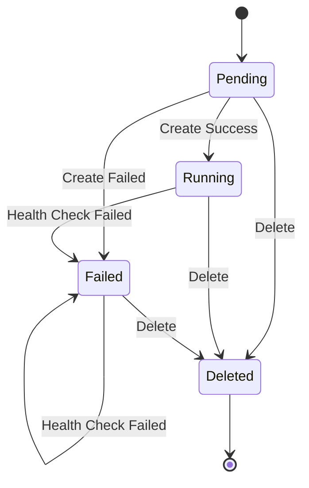

# Cluster Management

This document describes how Neutree manages clusters for deploying inference endpoints.

## Overview

Neutree supports two cluster modes to accommodate different infrastructure environments:

- **Kubernetes Mode**: Recommended for production. Cloud-native deployment using native Kubernetes resources.
- **Static Nodes Mode**: For bare-metal or VM environments. Provisions clusters via SSH using Ray and Docker.

Both modes are managed through the same Cluster resource API, with mode-specific configuration in the `spec.config` field.

## Kubernetes Mode

In Kubernetes mode, Neutree creates a dedicated namespace and deploys lightweight components for routing and monitoring. Endpoints are deployed as native Kubernetes Deployments.

### Components

- **Router**: Watches endpoint pods via Kubernetes API and routes inference requests based on labels. Exposed via LoadBalancer or Ingress.
- **Metrics Collector**: vmagent instance that scrapes Prometheus metrics from endpoint pods.

### Lifecycle

**Create**:
1. Validate kubeconfig and permissions
2. Create dedicated namespace `neutree-cluster-<hash>`
3. Create ImagePullSecret for private registries
4. Deploy Router (Deployment + Service)
5. Deploy Metrics Collector (Deployment + ConfigMap)
6. Wait for all components ready, then set status to `Running`

**Health Check**: Controller periodically checks component status. If unhealthy, cluster transitions to `Failed`.

**Delete**: Deleting the namespace cascades to all resources within.

## Static Nodes Mode

In static nodes mode, Neutree provisions a Ray cluster on bare-metal or VM nodes via SSH. Each node runs a Docker container hosting a Ray node (head or worker). Endpoints are deployed as Ray Serve applications.

### Components

- **Head Node**: Runs Ray head process, dashboard, and Ray Serve proxy for request routing
- **Worker Nodes**: Run Ray worker processes that execute endpoint replicas

### Lifecycle

The state machine is the same as Kubernetes mode. Key operations differ in implementation:

**Create**:
1. SSH to head node, run `ray up` to initialize Ray head in Docker container
2. SSH to each worker node, start Docker container and join Ray cluster
3. Wait for all nodes ready, then set status to `Running`

**Update** (worker nodes):
1. For new workers: SSH and join to cluster
2. For removed workers: Run `ray drain-node` for graceful removal, then stop container

**Delete**:
1. Stop worker containers
2. Run `ray down` on head node

**Health Check**: Controller queries Ray dashboard API to verify cluster health.

## Model Cache

Model cache stores models downloaded from remote registries (e.g., HuggingFace Hub) to avoid repeated downloads. Supported storage types:

- **HostPath**: Local directory on the node. Works for both cluster modes.
- **NFS**: Network file system. Kubernetes mode only.
- **PVC**: PersistentVolumeClaim. Kubernetes mode only.

## Image Registry

Clusters reference an ImageRegistry resource to pull container images. Neutree supports Docker-compatible registries (Docker Hub, Harbor, etc.).

- **Authentication**: Supports username/password or token-based auth
- **Self-signed certificates**:
  - Static Nodes: CA certificate is synced to `/etc/docker/certs.d/{registry-host}/` on each node
  - Kubernetes: Requires pre-configured trust on cluster nodes
