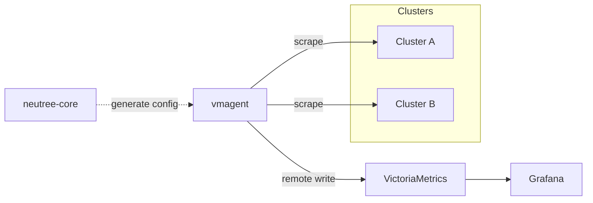

# Cluster Monitoring

This document describes how Neutree collects and stores metrics from clusters.

## Overview

Neutree uses VictoriaMetrics stack for monitoring:

- **vmagent**: Scrapes Prometheus metrics from clusters and endpoints
- **VictoriaMetrics**: Time-series database for storage and query
- **Grafana**: Visualization dashboards

## Dynamic Configuration

neutree-core includes a `collect-config-manager` module that manages scrape configurations dynamically.

**How it works**:
1. Resources that need monitoring implement a `ServiceMonitor` interface and register with `collect-config-manager`
2. Every minute, the module regenerates scrape configs for all registered resources
3. Updated configs are synced to vmagent automatically

**Cluster registration**:
- When a cluster reaches `Running` state, the Cluster Controller registers a `ClusterMonitor` with `collect-config-manager`
- When a cluster is deleted, the controller unregisters the monitor
- The `ClusterMonitor` generates scrape configs based on the cluster's metrics endpoints

## Metrics Endpoints

### Static Nodes Mode (Ray)

Ray clusters expose metrics at these endpoints:

| Metrics Source | Default Port | Description |
|----------------|--------------|-------------|
| Ray Dashboard | 44227 | Cluster-level metrics |
| Ray AutoScaler | 44217 | Autoscaler metrics |
| Ray Node | 54311 | Per-node metrics (configured via `--metrics-export-port`) |

### Kubernetes Mode

In Kubernetes mode, the Metrics Collector (vmagent) uses Kubernetes service discovery to find scrape targets. It discovers endpoint pods via labels and scrapes their Prometheus-compatible metrics endpoints.

## Deployment

**Local deployment**: vmagent runs alongside neutree-core. Configuration is shared via a local file path.

**Kubernetes deployment**: vmagent is deployed as a Deployment with scrape configs stored in a ConfigMap. Optionally connects to an external VictoriaMetrics instance via remote write.
