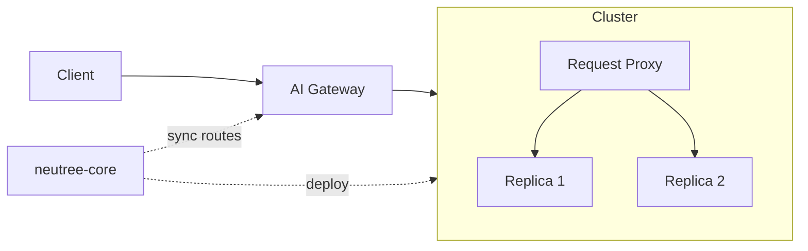

# Online Inference

This document describes how Neutree manages online inference services (Endpoints).

## Overview

Neutree provides OpenAI-compatible inference APIs with the following capabilities:

- **Multiple model types**: Text generation, embedding, reranker
- **Multiple inference engines**: vLLM, and other engines via plugin
- **High availability**: Multi-replica deployment with configurable placement
- **Load balancing**: KV cache-friendly routing strategies
- **Flexible GPU usage**: Tensor parallel (multi-GPU) and fractional GPU

## Architecture

Neutree handles two concerns for inference: **lifecycle management** and **request routing**.

- **AI Gateway**: Authenticates API keys and routes requests to the target cluster
- **Request Proxy**: Routes requests to replicas (Router in Kubernetes mode, Ray Serve Proxy in Static Nodes mode)
- **neutree-core**: Deploys endpoints and syncs routing config to AI Gateway
- **Images**: Kubernetes mode uses different images to run inference on different accelerators, and these are usually community-maintained images.

## Engine

An Engine defines an inference runtime (e.g., vLLM). Each engine can have multiple versions with different configurations.

- **Supported tasks**: Defines what model types the engine supports (text-generation, text-embedding)
- **Version schema**: Each version defines configurable parameters via JSON schema
- **Deploy template**: Kubernetes mode uses templates to generate Deployment manifests

## Endpoint

An Endpoint is a deployed inference service. Key configurations:

- **Cluster**: Target cluster to deploy on
- **Engine**: Inference engine and version (e.g., vLLM v0.6.0)
- **Model**: Model source and name from a ModelRegistry
- **Resources**: CPU, memory, GPU per replica
- **Replicas**: Number of replica instances
- **Variables**: Engine-specific parameters (e.g., `gpu_memory_utilization` for vLLM), validated against engine's schema
- **Env**: Environment variables injected into the inference container

## Load Balancing

When an endpoint has multiple replicas, the routing strategy affects KV cache hit rates. Supported strategies:

- **Round Robin**: Distributes requests evenly across replicas in rotation.
- **Consistent Hashing with Bounded Loads**: Routes requests with similar prefixes to the same replica for better KV cache reuse. Falls back to next replica when load exceeds threshold.

## GPU Allocation

Neutree uses `CUDA_VISIBLE_DEVICES` to control GPU access. Important notes:

- **No hard isolation**: Current version does not enforce GPU memory isolation at hardware level
- **Fractional GPU**: Multiple workloads sharing one GPU will all see the full device. Memory control relies on engine configuration (e.g., vLLM's `--gpu-memory-utilization`)
- **Tensor Parallel**: Workloads see multiple GPUs via `CUDA_VISIBLE_DEVICES`. Engine must correctly utilize all visible devices.
