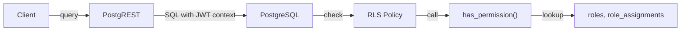

# RBAC and Workspace

This document describes Neutree's Role-Based Access Control (RBAC) and workspace-based resource isolation.

## Overview

Neutree provides enterprise-grade access control through:

- **RBAC**: Fine-grained permission control via roles and permissions
- **Workspace**: Resource isolation and visibility control across tenants

Both are enforced at the database level using PostgreSQL Row-Level Security (RLS), ensuring consistent authorization regardless of client (UI, API, CLI).

## Core Concepts

### Permission

A permission is defined as `{resource}:{action}`, for example:
- `cluster:create` - Create clusters
- `endpoint:read` - View endpoints
- `workspace:delete` - Delete workspaces

### Role

A role is a named collection of permissions. Roles can be:
- **Built-in**: Predefined by Neutree, cannot be modified by users
- **Custom**: Created by administrators for specific use cases

### RoleAssignment

A role assignment binds a user to a role. Assignments can be:
- **Global**: Applies to all workspaces
- **Workspace-scoped**: Applies only to a specific workspace

### Workspace

A workspace is a resource isolation boundary. Resources belong to a workspace, and users can only access resources in workspaces they are assigned to.

## Implementation

Authorization is enforced via PostgreSQL Row-Level Security (RLS). Each table has RLS policies that call a `has_permission()` function to check access on every query.



**How it works**:
1. PostgREST injects JWT claims into the PostgreSQL transaction context
2. RLS policy triggers on every row access
3. `has_permission()` extracts user ID via `auth.uid()` and checks against role assignments
4. Access is granted or denied at the row level

## RLS Policy Mapping

Each resource table has four RLS policies mapping to CRUD operations:

| Operation | SQL Action | Policy Check |
|-----------|------------|--------------|
| Read | SELECT | `has_permission(auth.uid(), 'resource:read', workspace)` |
| Create | INSERT | `has_permission(auth.uid(), 'resource:create', workspace)` |
| Update | UPDATE | `has_permission(auth.uid(), 'resource:update', workspace)` |
| Delete | DELETE | `has_permission(auth.uid(), 'resource:delete', workspace)` |

**Example**: Cluster table policies

```sql
CREATE POLICY "cluster read policy" ON api.clusters
    FOR SELECT
    USING (has_permission(auth.uid(), 'cluster:read', (metadata).workspace));

CREATE POLICY "cluster create policy" ON api.clusters
    FOR INSERT
    WITH CHECK (has_permission(auth.uid(), 'cluster:create', (metadata).workspace));
```

The `has_permission()` function checks if the current user has the required permission by looking up their role assignments and the permissions defined in those roles.
