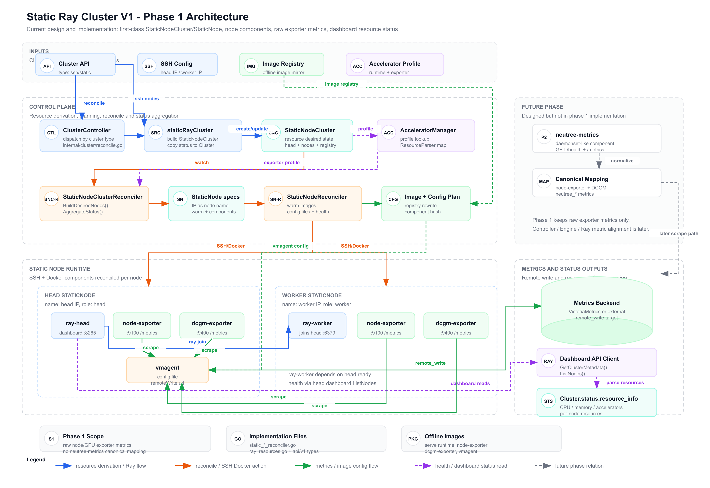

# Static Ray Cluster Backend Design



## 1. 背景

当前 SSH/Ray 静态集群的生命周期主要由集群级 reconcile 串行推进，head node 依赖 `ray up`，worker node 走 Neutree 自己的 SSH/Docker 启动路径。这个模型在静态节点场景下有三个主要问题：

1. 单个节点 SSH 慢、镜像拉取失败或 worker 启动失败时，会阻塞整个集群同步。
2. head 和 worker 启动路径不一致，`ray up` 引入 Ray autoscaler local provider、bootstrap config、provider tag 等静态集群不需要的状态来源。
3. 静态 Ray 集群缺少和 Kubernetes 集群一致的节点观测组件部署能力，后续 Node/GPU metrics 很难对齐。

本设计把静态 Ray 集群拆成集群级资源和节点级资源，由节点资源独立收敛节点上的常驻组件，为后续静态集群 observability 和升级语义打基础。

## 2. 目标与非目标

### 2.1 目标

1. 引入 `StaticNodeCluster` 和 `StaticNode` 两个一等资源，分别表达集群级期望状态和节点级期望状态。
2. 将节点上的常驻组件抽象为 `NodeComponent`，并固定作为 `StaticNode` 的嵌入式 workload。
3. 静态 Ray 集群不再通过 `ray up` 启动 head node，head 和 worker 都由 `StaticNodeReconciler` 通过 SSH/Docker 收敛。
4. 支持静态节点多组件部署：`ray-head`、`ray-worker`、`node-exporter`、`accelerator-exporter`、head-local `vmagent`。
5. 支持 `StaticNode.spec.warm.images`，由节点级 reconcile 执行镜像预热。
6. `StaticNodeReconciler` 自动探测节点 accelerator，并把结果写入 `StaticNode.status.accelerator`。
7. 通过 accelerator plugin profile 下发运行时配置和 accelerator exporter 部署资产。
8. 静态集群 ready 后，通过 Ray dashboard 聚合 `Cluster.status.resource_info`。
9. 建立静态集群 raw metrics 采集链路，后续再引入 `neutree-metrics` 做 canonical metrics mapping。

### 2.2 非目标

1. 不把 `NodeComponent` 做成独立资源，也不规划独立 `NodeComponent` controller。
2. 当前设计不实现完整 `Warm -> StopCluster -> StartCluster -> Verify` 升级状态机。
3. 当前设计不实现 `neutree-metrics`，不生成 `neutree_*` canonical metrics。
4. 当前设计不做 Controller、Engine、Ray 指标归一化。
5. 不让 accelerator plugin 维护 metrics mapping 或 normalization rules。
6. 不支持 Ray autoscaler 管理静态节点。
7. 不依赖 `ray_bootstrap_config.yaml` / `ray_bootstrap_key.pem`。
8. 不实现 vmagent HA。
9. 不实现通用 component 插件系统。
10. 不实现 model warm，仅预留语义。
11. 当前设计不在 `Cluster` / `StaticNodeCluster` / `StaticNode.spec` 中开放 `accelerator_type` 配置；accelerator 类型只来自节点探测结果。

## 3. 总体架构

### 3.1 资源关系

```text
Cluster(type=ssh/static)
  -> StaticNodeCluster
      -> StaticNode[]
          -> spec.components[]   // NodeComponentSpec
          -> status.components[] // NodeComponentStatus
```

`Cluster` 仍是对外已有的集群资源。对于静态 SSH/Ray 集群，`ClusterController` 派生一个 `StaticNodeCluster`，再由 `StaticNodeClusterController` 派生每个 `StaticNode`。节点上的组件不单独建资源，统一嵌入在 `StaticNode` 中。

### 3.2 Package Layer

本设计按 API、Controller、Reconcile、Accelerator、Command Runner 分层，避免对象存储、节点 SSH 执行和 accelerator 插件规则互相耦合。

| Package | 职责 | 依赖方向 |
| --- | --- | --- |
| `api/v1` | 定义 `StaticNodeCluster`、`StaticNode`、`NodeComponent`、`Warm`、`AcceleratorProfile` 等 API schema 和状态结构 | 不依赖业务包 |
| `controllers` | 对接对象存储和通用 controller 框架，处理 API object 的 list/upsert/delete/status patch | 依赖 `api/v1`、`internal/cluster` |
| `internal/cluster` | 放置静态集群 reconcile 核心逻辑，包括 `StaticNodeClusterReconciler`、`StaticNodeReconciler`、Ray runtime、resource info 聚合 | 依赖 `api/v1`、`pkg/command_runner`，通过接口依赖 accelerator 能力 |
| `internal/accelerator` | 管理内置和外部 accelerator plugin，提供 profile、runtime profile、resource converter/parser 能力 | 依赖 plugin contract 和 `api/v1` |
| `pkg/command_runner` | 提供 SSH/Docker/remote file 抽象，隐藏远程命令和远程写文件细节 | 不依赖 cluster controller |

分层约束：

1. `controllers` 只负责编排对象存储和调用 reconcile，不拼接 Docker/Ray 命令。
2. `internal/cluster` 不直接读写数据库或对象存储，所有持久化通过 store interface 注入。
3. `StaticNodeReconciler` 只通过 `command_runner` 操作节点，不直接依赖具体 SSH client。
4. accelerator 相关的厂商规则留在 `internal/accelerator` 或 plugin 中，`internal/cluster` 只消费确定性的 status/profile。

### 3.3 控制面职责

| 模块 | 职责 | 是否执行 SSH |
| --- | --- | --- |
| `staticRayClusterReconciler` | 从现有 `Cluster` 派生 `StaticNodeCluster`，并把 status/resource info 同步回 `Cluster` | 否 |
| `StaticNodeClusterController` | list/upsert/delete `StaticNode`，聚合 `StaticNodeCluster.status`；worker 资源可以先创建，组件启动由节点级 gate 控制 | 否 |
| `StaticNodeClusterReconciler` | 纯规划器，消费 `StaticNode.status.accelerator`，生成 desired `StaticNode`、components、warm images、vmagent config、component hash | 否 |
| `StaticNodeController` | 为单个节点创建 runner，调用节点级 reconciler，更新 `StaticNode.status` | 是 |
| `StaticNodeReconciler` | 先执行 accelerator discovery，再收敛单个节点的 warm、config files、Docker container、health check | 是 |

### 3.4 部署结果

| 节点角色 | 组件 |
| --- | --- |
| head | `ray-head`、`node-exporter`、可选 `accelerator-exporter`、`vmagent` |
| worker | `ray-worker`、`node-exporter`、可选 `accelerator-exporter` |

`vmagent` 当前只部署在 head node 上，负责 scrape 所有静态节点的 node-exporter / accelerator exporter，并 remote write 到指标后端。

## 4. API 与资源模型

本节 YAML 是 API 语义的准确定义，Go type、controller 读写字段和测试断言都需要以这里的字段为准。

### 4.1 StaticNodeCluster

`StaticNodeCluster` 表达一个静态 Ray 集群的集群级期望状态。

核心 spec：

```yaml
spec:
  version: v1.2.0
  image_registry: registry.example.com/neutree
  metrics_remote_write_url: http://vm:8480/insert/0/prometheus/
  head:
    node_name: 10.0.0.10
  nodes:
    - name: 10.0.0.10
      ip: 10.0.0.10
      role: head
    - name: 10.0.0.11
      ip: 10.0.0.11
      role: worker
```

核心 status：

```yaml
status:
  phase: Ready
  desired_nodes: 2
  ready_nodes: 2
  head_ready: true
  metrics_ready: true
  warm_ready: true
  error_message: ""
```

设计要求：

1. `StaticNodeCluster` 不执行节点级动作，只生成和聚合期望状态。
2. 节点名在静态集群中默认使用节点 IP，降低 name/IP 映射复杂度。
3. head / worker `StaticNode` 都可以先 upsert，避免 head 未 ready 时阻塞 worker discovery。
4. `image_registry` 用于重写组件镜像，保证组件镜像来自离线镜像包和目标 registry。
5. `StaticNodeCluster.spec.nodes` 不包含 accelerator type；cluster 只声明节点清单，accelerator 事实由每个 `StaticNode.status.accelerator` 承接。
6. worker component reconcile 必须依赖 head `StaticNode` ready，避免 worker 在 head dashboard / GCS 不可用时启动。

### 4.2 StaticNode

`StaticNode` 表达单个静态节点的节点级期望状态。

核心 spec：

```yaml
spec:
  cluster: demo
  ip: 10.0.0.10
  role: head
  warm:
    images:
      - name: ray-runtime
        ref: registry.example.com/neutree/neutree-serve:v1.2.0
        required: true
      - name: node-exporter
        ref: registry.example.com/neutree/prometheus/node-exporter:v1.8.2
        required: true
  components:
    - name: ray-head
      type: ray-head
      image: registry.example.com/neutree/neutree-serve:v1.2.0
      config_hash: sha256:...
    - name: node-exporter
      type: node-exporter
      image: registry.example.com/neutree/prometheus/node-exporter:v1.8.2
      config_hash: sha256:...
    - name: vmagent
      type: metrics-agent
      image: registry.example.com/neutree/victoriametrics/vmagent:v1.115.0
      config_hash: sha256:...
```

核心 status：

```yaml
status:
  phase: Ready
  accelerator:
    type: ascend
    vendor: huawei
    product_name: Ascend 910B
    product_model: ascend910b
    runtime_profile: ascend910b
    resource_name: ASCEND910B
    devices:
      - id: "0"
        uuid: "..."
        product_name: Ascend 910B
        healthy: true
  warm:
    images:
      - name: ray-runtime
        ref: registry.example.com/neutree/neutree-serve:v1.2.0
        ready: true
  components:
    - name: ray-head
      type: ray-head
      ready: true
      observed_hash: sha256:...
      observed_image: registry.example.com/neutree/neutree-serve:v1.2.0
  error_message: ""
```

设计要求：

1. `StaticNode` 是节点级 reconcile 的最小调度单元。
2. 单个节点失败只影响该节点 status，不阻塞其他节点 reconcile。
3. `StaticNode.status.components` 是 component 观测事实来源。
4. `StaticNode.status.phase` 由 warm 和 components 的结果聚合得到。
5. `StaticNode.metadata.name` 是节点名，默认使用节点 IP。
6. `StaticNode.spec.cluster` 是所属 `StaticNodeCluster` 名称，worker 通过它反查 `StaticNodeCluster` 和 head `StaticNode`。
7. `StaticNode.spec` 不接受用户配置的 `accelerator_type`；`StaticNode.status.accelerator` 是本节点 accelerator 的事实来源。

`StaticNode.status.accelerator` 字段语义：

```yaml
accelerator:
  type: ascend             # required; CPU fallback 使用 cpu
  vendor: huawei           # required; CPU fallback 使用 generic
  product_name: Ascend 910B
  product_model: ascend910b
  runtime_profile: ascend910b
  resource_name: ASCEND910B
  devices:
    - id: "0"
      uuid: "..."
      product_name: Ascend 910B
      healthy: true
```

CPU 节点、无法识别 accelerator 或非致命探测异常时使用确定性的 CPU fallback：

```yaml
accelerator:
  type: cpu
  vendor: generic
  product_name: CPU
  product_model: cpu
  runtime_profile: cpu
  resource_name: CPU
  devices: []
```

| 字段 | 说明 |
| --- | --- |
| `type` | required；accelerator 类型，也就是集群内部使用的 `accelerator_type`，仅出现在 status |
| `vendor` | 厂商，例如 `nvidia`、`amd`、`huawei` |
| `product_name` | 厂商展示名，例如 `Ascend 910B` |
| `product_model` | 归一化型号，例如 `ascend910b` |
| `runtime_profile` | 用于选择 runtime profile 的 key，可细化到同厂商不同型号 |
| `resource_name` | Ray resource name 或静态 Ray 内部资源名 |
| `devices` | 设备列表，包含 id、uuid、product_name、healthy 等节点本地事实 |

产品化 API 不暴露探测来源或可信度这类非确定性字段。探测链路必须返回确定的 accelerator 配置；无法确定 accelerator 时返回 CPU fallback。具体探测细节只进入 debug log 或 event。

### 4.3 NodeComponent

`NodeComponent` 是 Neutree 在节点上管理的常驻工作负载，生命周期依附于 `StaticNode`。

`NodeComponentSpec` / `NodeComponentStatus` 固定嵌入 `StaticNode.spec.components` / `StaticNode.status.components`。后续即使新增 component type，也继续通过 `StaticNode` 承载，不引入独立 `NodeComponent` resource 或 controller。

当前支持的 component type：

| Type | 说明 |
| --- | --- |
| `ray-head` | Ray head runtime container |
| `ray-worker` | Ray worker runtime container |
| `node-exporter` | 节点基础指标 exporter |
| `accelerator-exporter` | accelerator profile 声明的 GPU/NPU exporter，例如 `dcgm-exporter` |
| `metrics-agent` | head-local `vmagent` |

后续阶段预留：

| Type | 说明 |
| --- | --- |
| `metrics-normalizer` | `neutree-metrics` 节点级指标归一化组件 |

`NodeComponentSpec` 字段：

| 字段 | 说明 |
| --- | --- |
| `name` | 节点内唯一组件名 |
| `type` | 组件类型 |
| `image` | 组件镜像，已经过 `image_registry` 重写 |
| `command` / `args` | 容器启动命令 |
| `env` | 容器环境变量 |
| `ports` | 健康检查和 scrape 使用的端口 |
| `volumes` | Docker volume/bind mount |
| `docker_run_options` | runtime、network、capability、GPU 等 Docker 参数 |
| `config_files` | 需要写到远端节点的配置文件 |
| `health_check` | command 或 HTTP health check |
| `dependencies` | 节点内组件依赖 |
| `restart_policy` | 组件重启策略 |
| `config_hash` | 由 image、command、args、env、options、config_files 等期望状态计算得到 |

`NodeComponentStatus` 字段：

| 字段 | 说明 |
| --- | --- |
| `ready` | 组件是否 ready |
| `phase` | 组件当前阶段 |
| `observed_hash` | 实际容器上的 component hash label |
| `observed_image` | 实际运行镜像 |
| `reason` | 机器可读原因 |
| `message` | 人可读错误信息 |
| `last_transition_time` | 状态变化时间 |

### 4.4 Warm

`StaticNode.spec.warm` 表达节点需要提前准备的资源集合。

当前只实现 image warm：

```yaml
spec:
  warm:
    images:
      - name: ray-runtime
        ref: registry.example.com/neutree/neutree-serve:v1.2.0
        required: true
```

`StaticNodeClusterReconciler` 根据实际 component image 生成 `spec.warm.images`。`StaticNodeReconciler` 执行：

1. `docker image inspect`
2. 缺失时 `docker pull`
3. 回填 digest、ready、reason、message

当前只聚合 `warm_ready`，不把 warm 成功作为进入 stop/start 阶段的触发条件。完整升级状态机放到后续阶段。

### 4.5 Accelerator Discovery

当前设计只开放自动探测，不开放 `accelerator_type` 手工配置。

设计原则：

1. `Cluster` / `StaticNodeCluster` 不负责 SSH 到节点探测 accelerator。
2. `StaticNodeCluster.spec.nodes` 和 `StaticNode.spec` 不包含 `accelerator_type`。
3. `StaticNodeReconciler` 在节点级 reconcile 开始时执行 accelerator discovery。
4. 探测结果写入 `StaticNode.status.accelerator`。
5. `StaticNode.status.accelerator` 是后续生成 Ray runtime、accelerator exporter、accelerator-specific warm images 的唯一事实来源。
6. `StaticNodeReconciler` 依赖 `internal/accelerator.Manager` 扩展接口，不直接绑定具体厂商 plugin。
7. discovery 无法确认 accelerator 或遇到非致命探测异常时，写入 CPU fallback；CPU 节点也可以启动 Ray。

探测结果结构：

```yaml
status:
  accelerator:
    type: ascend
    vendor: huawei
    product_name: Ascend 910B
    product_model: ascend910b
    runtime_profile: ascend910b
    resource_name: ASCEND910B
    devices:
      - id: "0"
        uuid: "..."
        product_name: Ascend 910B
        healthy: true
```

`internal/accelerator.Manager` 需要扩展两类节点级接口，并把原 `GetAcceleratorProfile` 语义调整为 `RuntimeProfile`：

```go
type AcceleratorManager interface {
    DetectAccelerator(ctx context.Context, runner command_runner.CommandRunner) (*StaticNodeAcceleratorStatus, error)
    RuntimeProfile(ctx context.Context, accelerator StaticNodeAcceleratorStatus) (*AcceleratorProfile, bool, error)
}
```

接口语义：

1. `DetectAccelerator` 在节点本地探测加速卡信息，返回可直接写入 `StaticNode.status.accelerator` 的结构。
2. `DetectAccelerator` 对非致命探测异常返回 CPU fallback；只有 SSH runner 不可用这类基础设施错误才返回 error。
3. `RuntimeProfile` 根据 `status.accelerator.runtime_profile` 或 `status.accelerator.type` 获取运行时 profile。
4. plugin 内置 default profile，用于描述默认 runtime、exporter、resource defaults。
5. 同一厂商不同型号需要不同 runtime 时，通过不同 `runtime_profile` 区分，例如 `ascend310p` / `ascend910b`。
6. CPU fallback 的 `RuntimeProfile` 可以返回 unsupported，此时不生成 accelerator runtime 或 accelerator exporter，但继续生成 Ray 和 node-exporter components。

reconcile 时序：

```text
1. StaticNodeClusterController 创建最小 StaticNode。
2. StaticNodeReconciler SSH 到节点并执行 accelerator discovery。
3. StaticNodeController 写入 StaticNode.status.accelerator；无法识别时写入 CPU fallback。
4. StaticNodeClusterReconciler 基于 status.accelerator 和 RuntimeProfile 生成 accelerator-dependent components。
5. worker discovery 完成后，StaticNodeClusterReconciler 更新 head node 的 vmagent scrape config。
6. StaticNodeReconciler 根据最新 component spec 写入配置、更新 config hash，并启动或重建 ray-head / ray-worker / accelerator-exporter / vmagent。
```

#### 4.5.1 PCI 不可用时的探测语义

PCI 只能作为低成本的硬件粗探测来源，不能作为所有 accelerator 的唯一事实来源。NFD 的 PCI source 也是读取 `/sys/bus/pci/devices` 下的 `class`、`vendor`、`device`、`subsystem_vendor`、`subsystem_device` 等字段，再根据规则生成 `feature.node.kubernetes.io/pci-*` label。NVIDIA GPU Operator 基于 NFD PCI label 判断节点是否有 NVIDIA GPU；AMD GPU Operator 通过 NodeFeatureRule 维护 `vendor=1002` 和 device id 列表。但 NPU 类设备不一定能通过 PCI 稳定识别到具体型号，Ascend / Gaudi 这类实现通常依赖厂商 SDK、CLI 或设备文件获取芯片名、设备列表、UUID 和健康状态。

Kubernetes 上确认节点有 NPU 的权威链路不是 PCI，而是 device plugin 向 kubelet 注册 extended resource 后写入 Node status：

```yaml
status:
  capacity:
    huawei.com/Ascend910B: "8"
  allocatable:
    huawei.com/Ascend910B: "8"
```

因此 K8s 的完整语义是：

```text
1. vendor discovery / device plugin 在节点本地探测硬件。
2. device plugin 向 kubelet 注册 resource name 和 healthy devices。
3. kubelet 更新 Node.status.capacity / Node.status.allocatable。
4. scheduler 根据 extended resource 进行调度。
```

“先探测再部署 device plugin”是 operator 的部署优化，不是 Kubernetes 的强制语义。常见模式包括：

1. device plugin DaemonSet 部署到候选节点，由插件自行探测设备，没有设备时不注册资源或注册 0 个设备。
2. operator 先通过 NFD / vendor discovery 给节点打 label，再只在命中的节点部署 device plugin、exporter、runtime 组件。
3. 私有化环境通过平台或人工 label 标记候选节点，再部署厂商 device plugin。

静态 Ray 集群没有 kubelet / device plugin 的资源注册链路，因此不能依赖 Kubernetes Node status。Neutree 需要在 `StaticNodeReconciler` 中承担本地探测职责：

```text
1. 优先执行 generic PCI probe，采集原始 PCI facts。
2. PCI 无法确认型号或无法识别 accelerator 时，调用 accelerator plugin Probe 能力。
3. plugin 可使用 nvidia-smi / rocm-smi / npu-smi / DCMI / HLML / 设备文件等厂商方式补充探测。
4. 归一化结果写入 StaticNode.status.accelerator。
5. StaticNodeClusterReconciler 只消费 status.accelerator，不直接执行节点探测。
```

设计约束：

1. core 只维护通用 PCI fact 采集和少量 vendor 粗识别规则，不在 core 中维护完整厂商型号表。
2. 精确 `product_model`、`runtime_profile`、`resource_name` 由 accelerator plugin 或厂商规则返回。
3. K8s 集群场景如果已存在 device plugin 注册结果，应优先以 Node `capacity/allocatable` 作为资源事实。
4. 静态 Ray 场景以 `StaticNode.status.accelerator` 作为唯一资源事实；探测链路必须确定到 `type`、`runtime_profile` 和 `resource_name`，否则写入 CPU fallback。

如果节点是 CPU 节点、无法识别 accelerator，或探测过程遇到非致命异常：

1. 写入 CPU fallback。
2. 不生成 accelerator-dependent components。
3. 继续生成 Ray runtime、image warm、node-exporter 和 head `vmagent`。
4. `StaticNode.status.phase` 不因为 discovery fallback 进入 `Failed`；只有 SSH runner 创建失败、warm required image 失败或 required component 失败才影响 phase。
5. 不输出 `AcceleratorDiscoveryFailed` 这类终态错误；需要排障时通过 debug log 或 event 记录原始探测细节。

## 5. Reconcile 设计

### 5.1 Cluster 到 StaticNodeCluster

`staticRayClusterReconciler` 是现有 `Cluster` 到 `StaticNodeCluster` 的适配层。

流程：

```text
1. 读取 Cluster(type=ssh/static)。
2. 解析 SSH cluster config。
3. 使用 head IP / worker IP 派生 StaticNodeCluster.spec.nodes。
4. 使用镜像仓库生成 StaticNodeCluster.spec.image_registry。
5. create/update StaticNodeCluster。
6. 将 StaticNodeCluster.status 同步回 Cluster.status。
7. StaticNodeCluster ready 后，通过 Ray dashboard 聚合 Cluster.status.resource_info。
```

### 5.2 创建、更新、升级、删除流程

#### 5.2.1 创建

创建链路以现有 `Cluster` 为入口，所有派生资源由 controller 负责创建，用户不需要直接创建 `StaticNodeCluster` 或 `StaticNode`。

```text
Cluster(type=ssh/static)
  -> staticRayClusterReconciler creates/updates StaticNodeCluster
  -> StaticNodeClusterController creates/updates StaticNode(head + workers)
  -> StaticNodeReconciler detects accelerator and writes StaticNode.status.accelerator
  -> StaticNodeClusterReconciler plans accelerator-aware components and warm images
  -> StaticNodeReconciler warms images, writes config files, starts components
  -> StaticNodeClusterController aggregates StaticNodeCluster.status
  -> staticRayClusterReconciler copies status/resource_info back to Cluster.status
```

处理要求：

1. `ClusterController` 只派生 `StaticNodeCluster`，不直接创建 `StaticNode`。
2. `StaticNodeClusterController` 可以先创建 head / worker `StaticNode`，以便所有节点尽早完成 discovery。
3. worker `StaticNode` 在 head 未 ready 时仍可更新 `status.accelerator`，但不启动 `ray-worker` component。
4. worker discovery 完成后，head `vmagent` config 覆盖所有可观测节点。

#### 5.2.2 更新

更新链路由 spec/hash 驱动：

1. `Cluster.spec` 变化后，`staticRayClusterReconciler` 更新 `StaticNodeCluster.spec`。
2. `StaticNodeClusterReconciler` 根据最新 spec、当前 `StaticNode.status.accelerator` 和 runtime profile 重新生成 desired `StaticNode.spec`。
3. component image、command、env、docker options、config files 或 health check 变化时，`config_hash` 变化。
4. `StaticNodeReconciler` 只重建 hash 变化或健康检查失败的 component。
5. head `vmagent` scrape config 随节点、role、IP、exporter、metrics path 或 labels 变化而更新。

新增节点流程：

1. `Cluster.spec` 增加 worker IP 后，`staticRayClusterReconciler` 把该 IP 写入 `StaticNodeCluster.spec.nodes`。
2. `StaticNodeClusterController` 创建新的 worker `StaticNode`，不等待 head ready。
3. 新 worker `StaticNodeReconciler` 先执行 accelerator discovery，并写入 `StaticNode.status.accelerator`。
4. `StaticNodeClusterReconciler` 基于新 worker accelerator status 生成 runtime、warm images、`ray-worker`、node-exporter、accelerator-exporter 等 component。
5. 新 worker 在处理 `ray-worker` component 前检查 head ready；head 未 ready 时保持 component pending，不影响 discovery 和 image warm。
6. head `vmagent` config 增加该 worker 的 node-exporter / accelerator-exporter scrape target。

删除节点流程：

1. `Cluster.spec` 移除 worker IP 后，`staticRayClusterReconciler` 从 `StaticNodeCluster.spec.nodes` 移除该节点。
2. `StaticNodeClusterController` 对比 desired/current，soft delete stale `StaticNode`。
3. stale `StaticNode` 删除触发节点级清理，停止由 Neutree 管理的 Ray worker、node-exporter、accelerator-exporter 等 containers。
4. head `vmagent` config 删除该节点的 scrape target。
5. 删除 head 节点不作为普通更新处理；需要先进入删除集群或后续完整升级状态机语义。

#### 5.2.3 升级

当前升级行为落在普通更新链路上，但 Ray runtime 升级需要明确 head / worker 的启动约束：

1. 用户更新 `Cluster.spec.version` 或 runtime 相关配置。
2. `staticRayClusterReconciler` 更新 `StaticNodeCluster.spec.version`。
3. `StaticNodeClusterReconciler` 重新生成所有 `StaticNode.spec.warm.images`，确保新的 Ray runtime image 被预热。
4. `StaticNodeClusterReconciler` 更新所有 `StaticNode.spec.components[ray-head|ray-worker]` 的 image、command/env/options 和 `config_hash`。
5. 每个 `StaticNodeReconciler` 先完成 image warm；warm 失败时不进入对应 Ray component 重建。
6. head node 检测到 `ray-head` component hash 变化后，执行 stop old container -> start new container -> dashboard health check。
7. worker node 检测到 `ray-worker` component hash 变化后，先等待 head ready，再执行 stop old container -> start new container -> dashboard `ListNodes` health check。
8. exporter 或 vmagent image 变化只重建对应观测 component，不触发 Ray runtime stop/start。
9. head `vmagent` config 随 runtime 和节点状态变化重新生成。
10. `Cluster.status.resource_info` 在集群 ready 后重新从 Ray dashboard 聚合。

完整 `Warm -> StopCluster -> StartCluster -> Verify` 升级状态机是后续增强；当前不输出 `Stopping`、`Starting`、`Verifying`。
当前支持 component 级滚动重建：只有 `config_hash` 变化的 component 会被重建。Ray runtime 升级只重建 `ray-head` / `ray-worker`，不会重启 node-exporter、accelerator-exporter 或 vmagent。

#### 5.2.4 删除

删除链路遵循 owner 派生资源清理语义。所有 controller 级联对象删除都走 soft delete：父资源只给子资源设置 deletion timestamp，不直接跳过子资源的节点级清理。

1. `Cluster` 删除时，`staticRayClusterReconciler` soft delete 对应 `StaticNodeCluster`。
2. `StaticNodeCluster` 删除或 nodes spec 移除某个节点时，`StaticNodeClusterController` soft delete stale `StaticNode`。
3. `StaticNode` 进入 deletion path 后，`StaticNodeController` 创建 runner 并调用 `StaticNodeReconciler` 清理远端节点。
4. `StaticNodeReconciler` 先停止并删除由 Neutree 管理的 containers，再删除写入的配置文件。
5. 远端清理成功后，再删除 `StaticNode` 对象。
6. force delete 只删除对象状态，不保证远端节点容器和配置清理成功。

### 5.3 StaticNodeClusterController

集群级 controller 不执行 SSH，只同步 `StaticNodeCluster` 和 `StaticNode` 资源。

流程：

```text
1. 读取 StaticNodeCluster。
2. list 当前 StaticNode。
3. 调用 StaticNodeClusterReconciler.Plan 生成 desired nodes 和 cluster status。
4. upsert head / worker StaticNode，worker 不因 head 未 ready 而延迟创建。
5. soft delete stale StaticNode。
6. 更新 StaticNodeCluster.status。
```

### 5.4 StaticNodeClusterReconciler

`StaticNodeClusterReconciler` 是纯规划器，不读写存储，不执行 SSH。

职责：

1. 校验 `StaticNodeCluster.spec`。
2. 为每个节点生成 desired `StaticNode`。
3. 如果 `StaticNode.status.accelerator` 尚未就绪，只生成 discovery-safe desired state。
4. 如果 `StaticNode.status.accelerator` 已就绪，调用 `AcceleratorManager.RuntimeProfile` 获取 runtime profile。
5. 基于 accelerator status 和 runtime profile 为该节点生成 accelerator-aware `NodeComponent` 列表。
6. 根据 component image 生成 `StaticNode.spec.warm.images`。
7. worker 的 desired spec 可以包含 components，但 `ray-worker` component 需要 head ready gate。
8. worker discovery 完成后，为 head node 的 `vmagent` 生成覆盖所有节点 exporter 的 `config_files`。
9. 如果 worker accelerator status 变化，head `vmagent` config hash 必须变化，并由 head node reconcile 触发配置更新和组件重建或重载。
10. 统一使用 profile 中的 `metrics_path` 生成 scrape config。
11. 计算每个 component 的 `config_hash`。
12. 聚合当前 `StaticNode.status`，计算 `StaticNodeCluster.status`。

discovery-safe desired state 包含：

1. `cluster`、`ip`、`role`、`ssh_auth_ref` / `ssh_auth` 等连接信息。
2. 空 `warm.images` 和空 `components`。
3. 不包含 `accelerator_type`。

`StaticNodeController` 即使 `warm.images` 和 `components` 为空，也要为 discovery 创建 SSH runner。

### 5.5 StaticNodeController

`StaticNodeController` 是节点级资源入口。

流程：

```text
1. 读取 StaticNode。
2. 如果节点需要 deletion、discovery、warm 或 component reconcile，创建 SSH runner。
3. 调用 StaticNodeReconciler.Reconcile。
4. 根据 warm 和 component 结果计算 StaticNode.status.phase。
5. 更新 StaticNode.status。
```

删除路径：

```text
1. 读取带 deletion timestamp 的 StaticNode。
2. 创建 SSH runner。
3. 调用 StaticNodeReconciler.Delete。
4. 先停止并删除由 Neutree 管理的 containers。
5. 再删除由 Neutree 写入的配置文件。
6. 远端清理成功后删除 StaticNode 对象。
```

### 5.6 StaticNodeReconciler

`StaticNodeReconciler` 独立收敛单个节点。

流程：

```text
1. SSH 到节点。
2. 执行 accelerator discovery，并返回 `status.accelerator`。
3. 如果 discovery 无法识别 accelerator，返回 CPU fallback，不处理 accelerator-dependent components。
4. 收敛 spec.warm.images。
5. 处理 component 前检查 gate：worker 节点通过 `spec.cluster` 反查 `StaticNodeCluster` 和 head `StaticNode`，确认 head ready。
6. 按 spec.components 顺序处理 components。
7. 检查 dependencies。
8. 写入 config_files。
9. inspect 当前 Docker container。
10. 比较容器 component hash label 和 spec.config_hash。
11. hash 不匹配或容器不存在时，docker rm -f 后 docker run。
12. 执行 component health check。
13. 返回 accelerator、warm status 和 component status。
```

幂等性要求：

1. `config_hash` 未变化且容器健康时，不重建容器。
2. `config_files` 内容不变时，不重复写远端文件。
3. 单个 component 失败后，后续依赖它的 component 不启动，并在 status 中记录原因。
4. reconcile 可重复执行，不依赖本地临时状态。
5. component 级滚动重建只作用于 hash 变化的 component；Ray runtime 变化时，worker component 重建必须等待 head ready。

## 6. Ray Runtime 设计

### 6.1 移除 ray up

当前设计不再通过 `ray up` 管理 head node。保留 Ray 启动所需的 runtime 参数和健康检查，移除 Ray autoscaler/local provider 相关语义。

需要保留：

1. Ray runtime image、container name、host network、ulimit、shm、DOOD 相关 Docker run options。
2. 基于 `StaticNode.status.accelerator` 注入 accelerator runtime/env/options。
3. `ray stop` 后再 start，避免旧 raylet/GCS/dashboard 残留。
4. head 的 GCS、dashboard、client、metrics 等端口。
5. worker 通过 `--address=<head_ip>:6379` 加入集群。
6. dashboard API 健康检查。

需要移除：

1. Ray autoscaler local provider。
2. Ray provider tags。
3. Ray local cluster config cache。
4. `ray_bootstrap_config.yaml` / `ray_bootstrap_key.pem`。
5. `ray up --no-restart` 作为幂等控制手段。
6. `ray down` 作为全局 stop 手段。

### 6.2 Head / Worker 差异

head 和 worker 使用同一套 `NodeComponent` lifecycle，仅 Ray role 不同。

| 项 | Head | Worker |
| --- | --- | --- |
| component type | `ray-head` | `ray-worker` |
| start command | `python /home/ray/start.py --head ...` | `python /home/ray/start.py --address=<head_ip>:6379 ...` |
| autoscaler config | 不传 `--autoscaling-config` | 不涉及 |
| required ordering | 先于 worker ready | 依赖 head dashboard ready |
| health check | dashboard API reachable | head dashboard `ListNodes` 中当前 node IP 为 ALIVE |
| failure impact | 集群 not ready | 集群 degraded，不阻塞其他 worker |

### 6.3 健康检查

当前支持两类 health check：

1. command health check：通过节点 SSH runner 执行命令。
2. HTTP health check：控制面直接请求 `StaticNode.spec.ip` 或 `health_check.http_host`。

Ray component 使用 dashboard package：

1. `ray-head`：请求 head dashboard `GetClusterMetadata()`。
2. `ray-worker`：请求 head dashboard `ListNodes()`，检查当前 node IP 对应 Ray node 是否 `ALIVE`。

## 7. Remote File Interface

节点组件需要远程写配置，例如 head 上的 vmagent scrape config。为避免在 reconciler 中拼 heredoc，引入 `command_runner.FileClient`。

接口：

```go
type FileClient interface {
    WriteFile(ctx context.Context, remotePath string, content []byte, opts WriteFileOptions) error
    WriteFileIfChanged(ctx context.Context, remotePath string, content []byte, opts WriteFileOptions) (bool, error)
    ReadFile(ctx context.Context, remotePath string, opts ReadFileOptions) ([]byte, error)
    Stat(ctx context.Context, remotePath string, opts StatFileOptions) (*FileStat, error)
    Remove(ctx context.Context, remotePath string, opts RemoveFileOptions) error
}
```

设计要求：

1. `SSHCommandRunner` 提供 `Files() FileClient`。
2. `WriteFileIfChanged` 比较远端 sha256，不变则不写文件。
3. 写文件默认走临时路径 + atomic move/install。
4. 支持 `Sudo=true`，用于写 root-owned 路径。
5. component 的 `config_files` 内容进入 `config_hash`。

## 8. 镜像与离线包

组件镜像统一通过 `StaticNodeCluster.spec.image_registry` 重写。

示例：

| Source image | Rewritten image |
| --- | --- |
| `quay.io/prometheus/node-exporter:v1.8.2` | `<image_registry>/prometheus/node-exporter:v1.8.2` |
| `nvcr.io/nvidia/k8s/dcgm-exporter:3.3.9-3.6.1-ubuntu22.04` | `<image_registry>/nvidia/k8s/dcgm-exporter:3.3.9-3.6.1-ubuntu22.04` |
| `victoriametrics/vmagent:v1.115.0` | `<image_registry>/victoriametrics/vmagent:v1.115.0` |

离线镜像包需要包含：

| Accelerator | Images |
| --- | --- |
| `nvidia_gpu` | `neutree-serve`、`node-exporter`、`dcgm-exporter`、`vmagent` |
| `amd_gpu` | `neutree-serve:latest-rocm`、`node-exporter`、`vmagent` |

`StaticNode.spec.warm.images` 必须从最终 component image 推导，避免 warm 的镜像和实际运行镜像不一致。

## 9. Accelerator Plugin 边界

### 9.1 Profile 职责

accelerator plugin 可以通过 `AcceleratorProfile` 声明描述型能力：

```yaml
type: nvidia_gpu
runtime_profile: nvidia_gpu
cluster_runtime:
  runtime: nvidia
  options:
    - --gpus all
metrics:
  exporter:
    kind: dcgm-exporter
    component_type: accelerator-exporter
    image: nvcr.io/nvidia/k8s/dcgm-exporter:3.3.9-3.6.1-ubuntu22.04
    port: 9400
    metrics_path: /metrics
    docker_run_options:
      - --net=host
      - --gpus all
      - --cap-add=SYS_ADMIN
resource_defaults:
  ray_resource_name: GPU
  kubernetes_resource_name: nvidia.com/gpu
```

适合放在 profile 中：

1. 静态 Ray runtime/env/options。
2. accelerator exporter image、port、run options。
3. 简单 resource defaults。

不适合放在 profile 中：

1. node component templates。
2. metric mappings。
3. vmagent scrape config。
4. normalization rules。

### 9.2 RuntimeProfile 选择

`RuntimeProfile` 是从确定性 accelerator status 到运行时配置的映射接口。

选择规则：

1. 优先使用 `StaticNode.status.accelerator.runtime_profile`。
2. 如果 `runtime_profile` 为空，回退到 `StaticNode.status.accelerator.type`。
3. plugin 必须内置 default profile，保证常见 accelerator type 可以直接返回默认 runtime。
4. 同一厂商不同型号需要不同 CANN / ROCm / driver runtime 时，必须返回不同 `runtime_profile`。
5. profile 不决定 engine image；engine image 仍由 EngineVersion 决定。
6. CPU fallback 或 unsupported accelerator 可以返回 `found=false`，这不是错误，只表示不生成 accelerator runtime/options/exporter。
7. `AcceleratorProfile.metrics.exporter` 是 accelerator 采集组件的描述来源；存在时生成 `accelerator-exporter` component 和 vmagent scrape target，不存在时跳过。
8. node-exporter 是静态节点默认观测组件，不由 accelerator plugin 决定。

### 9.3 ResourceConverter / ResourceParser

复杂资源转换继续由行为型接口负责：

1. product group 转换。
2. 多产品型号映射。
3. MIG/topology/NUMA 等复杂规则。
4. validation/fallback。
5. 旧 schema 兼容。

资源转换优先级：

```text
1. plugin ResourceConverter / ResourceParser
2. profile.resource_defaults generic converter
3. unsupported
```

### 9.4 Endpoint 边界

Endpoint 通过 `AcceleratorManager` 仅依赖资源转换能力，用于把 endpoint resource spec 转换成 Ray / Kubernetes 需要的 resource key、resource name 和 count。

Endpoint runtime、engine image、env 和 options 由 EngineVersion、engine template 和集群运行时路径决定，不从 `AcceleratorProfile` 获取。

Endpoint 不消费：

1. `cluster_runtime`。
2. `metrics.exporter`。
3. node-exporter component。
4. accelerator-exporter component。
5. vmagent component。
6. 后续 `neutree-metrics` component。
7. metrics scrape config。

这些都属于 `StaticNodeCluster` / `StaticNode` 的节点运行时或观测平面。

## 10. Metrics Plane

### 10.1 Raw metrics 链路

当前只建立静态集群上的 raw metrics 采集基础。

```text
StaticNode(head):
  vmagent
    -> scrape node-exporter on every StaticNode
    -> scrape accelerator-exporter on every StaticNode when present
    -> remote write
```

生成规则：

1. `StaticNodeClusterReconciler` 为每个已完成 discovery 的节点默认生成 node-exporter component。
2. `StaticNodeClusterReconciler` 调用 `AcceleratorManager.RuntimeProfile` 获取 `AcceleratorProfile`。
3. 如果 `AcceleratorProfile.metrics.exporter` 存在，生成 accelerator-exporter component、warm image 和 scrape target。
4. 如果节点是 CPU fallback、profile unsupported 或 profile 未声明 exporter，只生成 node-exporter，不生成 accelerator-exporter。
5. head `vmagent` scrape config 统一覆盖所有节点的 node-exporter target，以及所有存在的 accelerator-exporter target。

每个 scrape target 需要补齐 Neutree labels：

| Label | 说明 |
| --- | --- |
| `workspace` | workspace |
| `neutree_cluster` | 对外 Cluster 名称 |
| `static_node_cluster` | StaticNodeCluster 名称 |
| `cluster_type` | `ray` |
| `node` | 静态节点名，建议使用 IP |
| `node_ip` | 节点 IP |
| `node_role` | `head` / `worker` |
| `source` | `node-exporter` / `accelerator-exporter` |
| `accelerator_type` | accelerator 类型，可选 |
| `accelerator_exporter` | exporter kind，可选 |

scrape path 统一来自 component/profile 的 `metrics_path`：

1. node-exporter 默认 `/metrics`。
2. accelerator-exporter 使用 `AcceleratorProfile.metrics.exporter.metrics_path`，为空时默认 `/metrics`。
3. 后续 `neutree-metrics` 也使用同一字段表达 `/metrics`，避免在 vmagent 生成逻辑里硬编码不同 exporter path。

当前不做指标重命名、单位转换或跨 exporter 归一化。dashboard、告警和 API 如果要消费这些指标，只能消费 raw exporter 指标和统一 labels。

### 10.2 后续 canonical metrics 链路

后续阶段引入 daemonset-like 的 `neutree-metrics` component：

```text
node-exporter / accelerator-exporter
  -> node-local neutree-metrics /metrics
      -> canonical neutree_* metrics
          -> head-local vmagent
              -> remote write
```

`neutree-metrics` 只暴露：

1. `/health`
2. `/metrics`

metrics mapping 由 `neutree-metrics` 内置维护，不放在 accelerator plugin 中维护。

## 11. 状态语义

资源级状态写入规则：

1. Controller 级状态机只写 `phase` 和 `error_message` 表达当前阶段和失败原因。
2. `StaticNodeCluster.status` 可以保留 `desired_nodes`、`ready_nodes`、`head_ready`、`metrics_ready`、`warm_ready` 这类聚合观测字段。
3. `StaticNode.status` 可以保留 `warm`、`components` 这类节点观测字段。
4. 当前设计不写 `conditions`，避免 `phase/error_message` 和 conditions 形成两套状态语义。
5. CPU fallback 不写入 `error_message`；只有基础设施错误、required warm 失败或 required component 失败才写入 `error_message`。

### 11.1 StaticNodeCluster phase

当前实际输出：

| Phase | 含义 |
| --- | --- |
| `Provisioning` | 资源已创建，但 head 或节点组件尚未 ready |
| `Ready` | head ready，所有 required node/component ready |
| `Degraded` | head ready，但部分 worker 或观测组件不 ready |
| `Failed` | spec 无法规划或出现不可恢复错误 |

`Warming`、`Stopping`、`Starting`、`Verifying` 是升级状态机的 API 预留 phase，当前不输出。

### 11.2 StaticNode phase

当前实际输出：

| Phase | 含义 |
| --- | --- |
| `Warming` | required warm images 尚未 ready |
| `Reconciling` | components 正在收敛或部分未 ready |
| `Ready` | required warm images 和 components 均 ready |
| `Failed` | SSH runner 创建失败或节点级 reconcile 返回不可恢复错误 |

`Pending`、`Degraded` 可作为后续更细状态预留。

### 11.3 故障聚合

| 故障 | 聚合结果 |
| --- | --- |
| head `ray-head` 不 ready | `StaticNodeCluster` 为 `Provisioning` 或 `Degraded` |
| worker `ray-worker` 不 ready | `StaticNodeCluster` 为 `Degraded`，不阻塞其他 worker |
| head `vmagent` 不 ready | head `StaticNode.status.components[vmagent]` 不 ready，cluster metrics degraded |
| `node-exporter` 不 ready | 对应 `StaticNode.status.components[node-exporter]` 不 ready |
| `accelerator-exporter` 不 ready | 对应 `StaticNode.status.components[accelerator-exporter]` 不 ready |
| 后续 `neutree-metrics` 不 ready | 对应节点 canonical metrics degraded |

## 12. Cluster ResourceInfo

静态集群 ready 后，`Cluster.status.resource_info` 通过 Ray dashboard 聚合：

1. 使用 head dashboard `ListNodes()` 获取 live Ray nodes。
2. 聚合 CPU、memory 和 accelerator resources。
3. memory 统一转为 GiB。
4. accelerator resources 通过 plugin `ResourceParser` 转换。
5. 聚合失败只记录 warning，不阻断 `StaticNodeCluster` status 同步。

该逻辑和原 SSH Ray 资源计算共用 helper，避免静态新架构和旧路径出现资源语义差异。

保持当前逻辑没有根本问题，但需要明确语义边界：

1. `StaticNode.status.accelerator` 表示节点物理 accelerator 探测事实。
2. `Cluster.status.resource_info` 表示 Ray dashboard 中已经注册并可被 Ray 调度的资源事实。
3. 两者不要求在任意中间态完全一致；如果节点探测到 accelerator，但 Ray runtime 未成功注册对应 resource，`resource_info` 不应凭探测结果补齐。
4. 当 `StaticNodeCluster` ready 后再聚合 `resource_info`，可以避免在 head/worker 未加入 Ray 时输出误导性的资源容量。
5. 如果后续需要排障，可以在状态中增加 warning，例如 `AcceleratorDetectedButRayResourceMissing`，但不改变 `resource_info` 的来源。

## 13. 升级语义

目标升级模型仍然是：

```text
Warm -> StopCluster -> StartCluster -> Verify
```

当前实现：

1. component image 推导 warm images。
2. `StaticNodeReconciler` 执行 image inspect/pull。
3. component hash 变化时重建对应 container。
4. 聚合 `warm_ready`。

后续阶段再实现：

1. `StaticNodeCluster` 推进升级 phase。
2. worker 先 stop，head 后 stop。
3. head 先 start，dashboard ready 后再 start workers。
4. Ray-only upgrade 不重启 node-exporter、accelerator-exporter、vmagent、`neutree-metrics`。
5. verify 阶段检查 dashboard、workers alive、resource info 和必要 metrics target。

## 14. 测试设计

### 14.1 Unit test

必须覆盖：

1. `StaticNodeClusterReconciler.BuildDesiredNodes`
   - head / worker component 生成。
   - head 未 ready 时仍生成 worker `StaticNode` discovery-safe spec。
   - worker component reconcile 通过 `spec.cluster` 反查 cluster 和 head node，并依赖 head ready gate。
   - vmagent 只在 head 上生成。
   - node-exporter 在所有节点生成。
   - `StaticNode.status.accelerator` 未就绪时不生成 accelerator-dependent components。
   - CPU fallback 节点生成 Ray 和 node-exporter，不生成 accelerator runtime/options/exporter。
   - 探测结果为 NVIDIA 时，基于 accelerator profile 生成 `accelerator-exporter`。
   - 未声明 exporter 的 accelerator 不生成 `accelerator-exporter`。
   - `RuntimeProfile` 返回 unsupported 时不阻塞 Ray 和 node-exporter 生成。
   - `AcceleratorProfile.metrics.exporter.metrics_path` 进入 vmagent scrape config。
   - warm images 从 component image 推导。
   - component image 走 `image_registry` 重写。
   - 新增 worker 后 head vmagent scrape config 增加该 worker target。
   - 删除 worker 后 head vmagent scrape config 删除该 worker target。
   - component image/env/options/config_files 变化时只重建 hash 变化的 component。
2. `StaticNodeReconciler`
   - reconcile 开始时执行 accelerator discovery。
   - discovery 成功后返回 `StaticNode.status.accelerator`。
   - discovery 无法识别或非致命探测异常时返回 CPU fallback，不返回终态错误。
   - CPU fallback 时不启动 accelerator-dependent components。
   - 即使 `warm.images` 和 `components` 为空，也会创建 runner 并执行 discovery。
   - warm image inspect 命中时不 pull。
   - warm image 缺失时 pull。
   - config_files 内容变化触发 rewrite 和 component hash 变化。
   - hash 未变化且 health ready 时不重建容器。
   - hash 变化时重建容器。
   - component 级滚动重建不影响 hash 未变化的其他 component。
   - ray-worker 通过 dashboard `ListNodes()` 判断当前 node IP alive。
   - deletion path 先清理由 Neutree 管理的 containers 和配置文件，再允许删除对象。
3. `AcceleratorManager`
   - `DetectAccelerator` 成功返回确定性 accelerator status。
   - `DetectAccelerator` 对无法识别 accelerator 返回 CPU fallback。
   - `DetectAccelerator` 对 SSH runner 不可用返回 error。
   - `RuntimeProfile` 基于 `runtime_profile` 优先选择 profile。
   - `RuntimeProfile` 对 CPU fallback 或 unsupported accelerator 返回 `found=false` 且不作为错误。
4. `FileClient`
   - `WriteFileIfChanged` 内容不变时返回 unchanged。
   - sudo/permission/atomic write 参数正确。
5. `StaticNodeClusterController`
   - 创建 head / worker `StaticNode` 时不等待 head ready。
   - 删除 stale `StaticNode` 时走 soft delete。
   - 只写 `phase/error_message` 和聚合观测字段，不写 `conditions`。
6. `Cluster.status.resource_info`
   - dashboard resources 正常聚合。
   - accelerator parser 被调用。
   - dashboard 失败不阻塞 cluster status。

### 14.2 DB test

如果不新增数据库 schema、RLS、trigger 或 migration，不需要新增 DB test。后续如果把 `StaticNodeCluster` / `StaticNode` 持久化模型落到新表，需要补充：

1. CRUD。
2. list by cluster/workspace。
3. status patch。
4. stale node delete。

### 14.3 E2E test

E2E 需要真实 SSH Ray 静态集群环境，开发完成后在 e2e gate 阻塞执行。

场景：

1. 创建静态 SSH Ray 集群后，`ClusterController` 创建 `StaticNodeCluster`。
2. `StaticNodeClusterController` 创建 head / worker `StaticNode`，worker 不因 head 未 ready 延迟创建。
3. 每个 `StaticNode.status.accelerator` 来自节点探测结果，而不是 spec 配置。
4. CPU 节点写入 CPU fallback，仍能启动 Ray 和 node-exporter。
5. 探测结果为 NVIDIA 的节点生成并启动 `dcgm-exporter`。
6. 所有节点的 `ray-head` / `ray-worker` ready。
7. 每个节点 `node-exporter` ready。
8. head `vmagent` ready。
9. vmagent scrape config 带 `neutree_cluster`、`static_node_cluster`、`workspace`、`node`、`node_ip`、`node_role`、`source` 等 labels。
10. accelerator exporter target 只在 profile 声明 exporter 时出现。
11. `Cluster.status.resource_info` 包含 CPU、memory 和 accelerator resource。
12. `StaticNode.spec.warm.images` 包含 ray runtime、node-exporter、vmagent 和存在的 accelerator exporter，并由 `StaticNodeReconciler` 拉取。
13. head start command 不依赖 Ray autoscaler config。
14. Ray runtime image 更新触发 `ray-head` / `ray-worker` 组件级滚动重建，不重启 exporter 和 vmagent。
15. 删除 worker 时，先清理远端 Ray worker、exporter 容器和配置，再删除 `StaticNode` 对象，head vmagent target 同步移除。
16. dashboard 不可达时，cluster status error message 包含 head IP 和 port 8265。

## 15. 回滚与兼容性

1. 对外仍以现有 `Cluster` API 为入口，静态集群用户不需要直接创建 `StaticNodeCluster`。
2. 新架构通过 `ClusterController` 派生资源，不改变已有 cluster create API。
3. 如果 `StaticNodeCluster` reconcile 失败，`Cluster.status` 同步失败原因。
4. 不再调用 `ray up` 后，head 上不会依赖 Ray bootstrap config；这属于静态集群内部实现变化。
5. 当前设计不改变 endpoint runtime API。
6. 当前设计不开放 `accelerator_type` 配置，已有 cluster 创建参数中的 accelerator hint 不作为静态节点事实来源。
7. 如果 accelerator profile 未声明 exporter，不部署 accelerator exporter，但不影响 Ray 集群启动。

## 16. 风险与后续工作

| 风险 / 限制 | 处理 |
| --- | --- |
| 当前 vmagent 只在 head 上，head 故障会影响 metrics remote write | 后续评估 vmagent HA 或外部 vmagent |
| 当前只采 raw metrics，不做 canonical mapping | 后续由 `neutree-metrics` 内置 mapping |
| component hash 覆盖期望状态，但不独立探测所有 bind mount drift | 后续如有必要补充更细 Docker inspect |
| 完整升级状态机未实现 | 后续实现 `Warm -> StopCluster -> StartCluster -> Verify` |
| model warm 未实现 | 后续扩展 `StaticNode.spec.warm.models` |
| 未知 accelerator 可能没有 exporter | profile 未声明时跳过 exporter，不阻塞集群 |
| accelerator 无法识别时无法部署对应 exporter/runtime options | 写入 CPU fallback，继续启动 Ray 和 node-exporter；原始探测细节进入 debug log 或 event |

## 17. 验收标准

1. 静态集群创建后自动生成 `StaticNodeCluster` 和 `StaticNode`。
2. `StaticNodeCluster` 和 `StaticNode` 独立 reconcile，单节点失败不阻塞其他节点。
3. worker `StaticNode` 可以先创建并完成 discovery，worker component reconcile 依赖 head ready。
4. head 和 worker 都不依赖 `ray up`。
5. `NodeComponent` 固定嵌入 `StaticNode`，不作为独立资源。
6. `StaticNode.spec` 不开放 `accelerator_type`，accelerator 类型来自节点探测并写入 `StaticNode.status.accelerator`。
7. 每个节点运行 node-exporter。
8. NVIDIA 节点运行 dcgm-exporter。
9. head 节点运行 vmagent 并 scrape 所有节点 exporter。
10. scrape target 带 Neutree labels。
11. `StaticNode.spec.warm.images` 由实际 component image 推导。
12. component image 统一走 `image_registry` 和离线镜像包。
13. 静态集群 ready 后，`Cluster.status.resource_info` 有 CPU、memory 和 accelerator resource。
14. accelerator plugin 可通过 profile 提供 runtime 配置和 exporter 部署资产。
15. 复杂资源转换继续通过 `ResourceConverter` / `ResourceParser` 完成。
