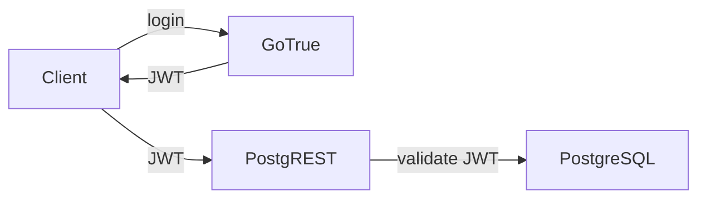

# User Management

This document describes how Neutree manages users and authentication.

## Overview

Neutree uses GoTrue (via Supabase Auth) for user management, providing:

- **JWT-based authentication**: Standard token-based auth for API access
- **Multiple registration methods**: Email/phone self-registration (configurable)
- **OAuth support**: Third-party login providers
- **Email verification**: Optional verification before account activation
- **Password reset**: Email-based password recovery

## Integration with PostgREST

GoTrue and PostgREST share the same JWT secret, enabling seamless authentication:

PostgREST extracts standard JWT claims and injects them into PostgreSQL transaction context. This enables database functions like `auth.uid()` to access the current user's identity for authorization checks.

## Schema Separation

Following security best practices, Neutree separates auth data from business data:

- **auth schema**: Managed by GoTrue, stores authentication data. Kept minimal and secure.
- **api schema**: Contains business resources including `user_profiles`

The `api.user_profiles` table maintains a one-to-one relationship with `auth.users`:

- Automatically created via database trigger when a user registers
- Linked via foreign key with `ON DELETE CASCADE` for automatic cleanup
- Extends user data with business attributes (e.g., display name)

**Design rationale**: By isolating auth schema from business logic, we avoid polluting the security-critical auth layer. All business logic should interact with `user_profiles` instead of `auth.users` directly.

**Sync**: The UserProfile Controller syncs spec changes (e.g., email updates) from `user_profiles` to GoTrue, ensuring the auth backend reflects admin-initiated changes.
